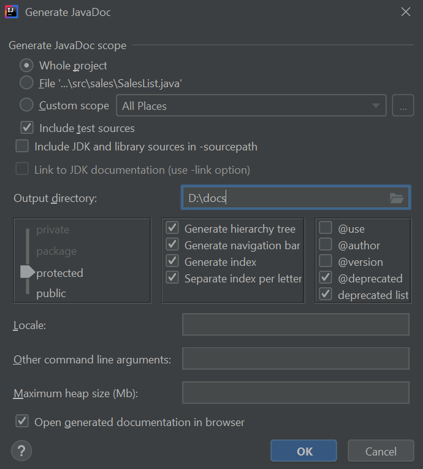

# Software documentation

## Documentation with IntelliJ

&nbsp;&nbsp;

Once we have set the *javadoc* comments following the instructions given in previous document, we can generate the final documentation from many different IDEs and tools. Regarding IntelliJ, we must go to *Tools > Generate JavaDoc* menu. In the dialog that will be shown, we must choose the output folder and the elements for which we want to generate the documentation (typically, the whole project). We can also choose the visibility of the elements to be included in the documentation. Typically, we choose either from public or protected elements.

    

After this, you can find the documentation in the output folder that you have specified in this dialog.

> **Exercise 1:**
>
> Generate the documentation for Exercise 1 and 2 of [previous document](09a)
