# Software testing

## Unit tests in Java using JUnit

<div style="text-align: right">
<a target="_blank" href="slides/10a.html"></a>&nbsp;&nbsp;
<a target="_blank" href="10a.pdf"></a>
</div>

Once the test cases have been designed, we start testing our application. In our case, we are going to use **JUnit**, a Java library for unit testing that also shows test reports that help us decide if we need to change the original code or not.

### 1. Creating the test folder

For instance, let's create a new Java project called `PersonTest`. Then, create a new package called `person.types` and place this `Person` class in it: 

```java
package person.types;

public class Person
{
    protected String name;
    protected String idCard;

    public Person()
    {
        name="";
        idCard="";
    }

    public Person(String name,String idCard)
    {
        this.name=name;
        this.idCard=idCard;
    }

    public String getName() {
        return name;
    }

    public void setName(String name) {
        this.name = name;
    }

    public String getIdCard() {
        return idCard;
    }

    public void setIdCard(String idCard) {
        this.idCard = idCard;
    }

    @Override
    public boolean equals(Object p)
    {
        return (this.idCard.equals(((Person)p).idCard));
    }

    @Override
    public String toString()
    {
        return name + " " + idCard;
    }
}
```

Now, we are going to learn how to create a unit test associated to this class, and define some test cases. First of all, it is recommended to **create an additional source folder to place all our tests in**, so that we don't mix them with the original source code. We can create a new directory called `tests` and right click on it, then we choose *Mark Directory as > Test Sources Root*.

<div align="center">
    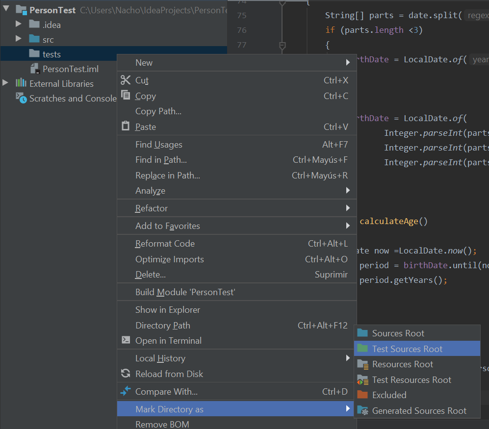
</div>

From now on, every test that we create will be automatically placed inside this source folder, with the same package name than the class that is being tested.

### 2. Creating test classes

In order to create a new unit test over `Person` class, place the cursor in the class name to be tested (`Person`, in our case) and press `Alt` + `Enter`. In the context menu, choose *Create test*.

<div align="center">
    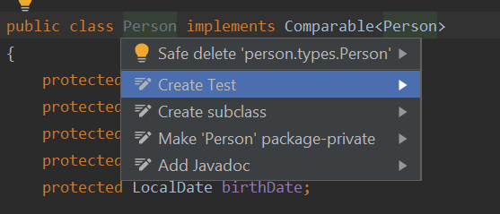
</div>

Then, a new dialog will appear to specify the contents of this unit test:

<div align="center">
    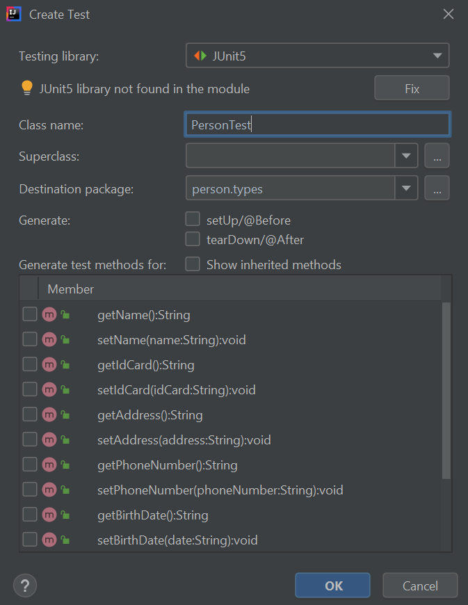
</div>

In the dialog that will be shown, we can: 

* Specify JUnit version. We will use the last one, which is version 5, and it corresponds to *JUnit Jupiter*. If a message appears indicating that *JUnit 5 library not found in the module*, we can press the *Fix* button and automatically download and add the library to the project:

<div align="center">
    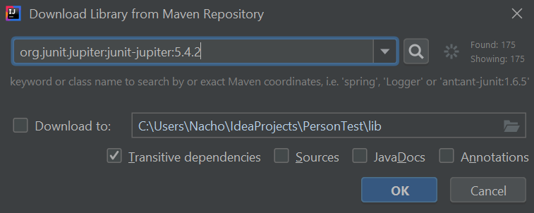
</div>

* We can also change the test class name and/or package name for this test class (although it is not recommended, nor usual)
* Finally, we can also choose which methods from the original class are going to be tested. We don't need to check any method now if we don't know which one(s) we need to test. We can add as many as we want later.

So, for now, we leave the default options of this dialog and click on the *OK* button. A new class called `PersonTest` has been created in the `person.types` package inside the `tests` source folder.

<div align="center">
    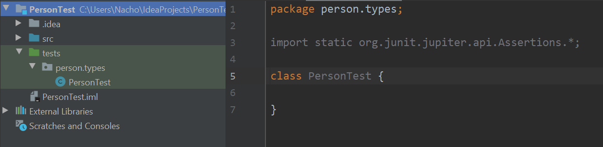
</div>

### 3. Adding test methods to the test class

Now, let's try to define a test method. For instance, let's create a test method for the `getName` method of `Person` class. To do this, we go again to `Person` class name, press `Alt` + `Enter` keys, and then choose the method(s) that we want to add to the test:

<div align="center">
    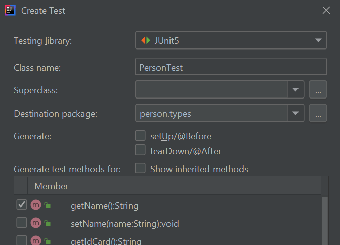
</div>

IntelliJ will ask us to confirm that we want to update existing test class, then we can proceed. Any old content of this class will be preserved, and then new method(s) will be added.

```java
package person.types;

import org.junit.jupiter.api.Test;
import static org.junit.jupiter.api.Assertions.*;

class PersonTest 
{
    @Test
    void getName()
    {
    }
}
```

In order to test this method, we can, for instance, create a new `Person` object with a given name, and then check if this name is the one that we expect. For this checkings, we can use `assertXXXXX` methods that are available through static import of `org.junit.jupiter.api.Assertions` package:

```java
package person.types;

import org.junit.jupiter.api.Test;
import static org.junit.jupiter.api.Assertions.*;

class PersonTest
{
    @Test
    void getName()
    {
        Person p = new Person("James", "11223344A");
        assertEquals("James", p.getName());
    }
}
```

Let's explain this code more in depth:

* `@Test` annotation indicates that the method above is a test. The method header has been automatically generated by JUnit.
* In this test we create a `Person` object with the (second) constructor
* Next, we check if *name* attribute is the one that we expect. We use `assertEquals` method with two arguments (expected result and actual result), to evaluate with the corresponding *getter* if the attribute has the expected value after creating the object. This method is in `org.junit.jupiter.api.Assertions` class in JUnit 5. There are also some other useful methods, such as `assertTrue`, `assertFalse` (we will see an example of these two methods later), `assertNull`, or `fail`, which can be used to automatically emit a failure according to some condition(s).

We can add as many assertions as we want in a test method. For instance, we can also check if name is not null before checking if it is "James":

```java
    @Test
    void getName()
    {
        Person p = new Person("James", "11223344A");
        assertNotNull(p.getName());
        assertEquals("James", p.getName());
    }
```

### 4. Running tests

If we want to run this test class, we can right click on it in the left panel and choose *Run PersonTest*.

<div align="center">
    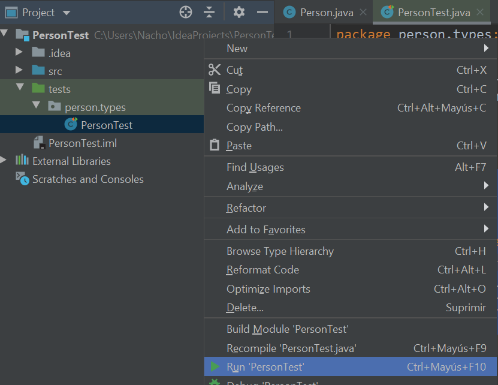
</div>

Then, we will see a JUnit panel with the results of every test contained in the test class:

<div align="center">
    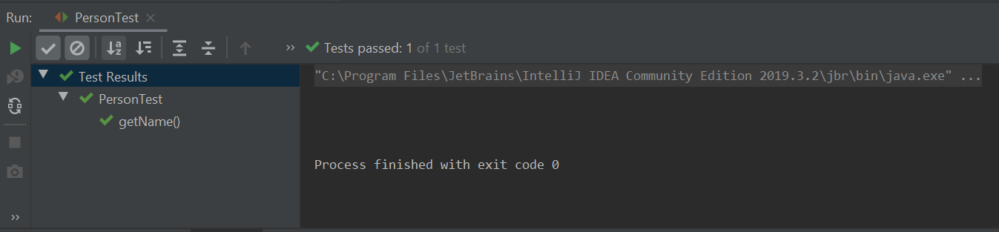
</div>

If every test has been successful, then we will get a green icon, otherwise we will see an error icon next to each test method that has failed.

<div align="center">
    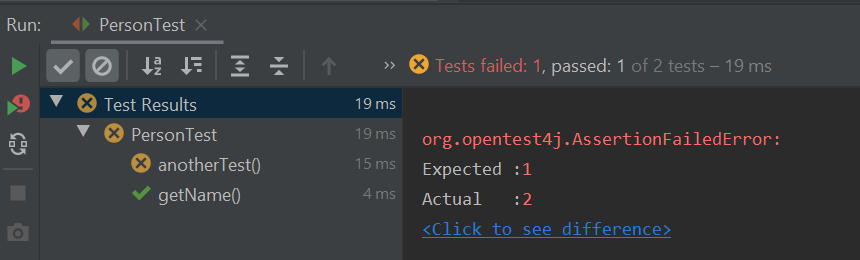
</div>

### 5. Initializations and closings.

If we need to have some previously initialized data before starting the tests, or some conditions previously established, we can use the annotation `@BeforeEach`. We can also use the annotation `@AfterEach` to close or free some resources after the tests have been performed.

There is a method called `setUp` that is usually employed to initialize data for every test case before they are launched. So we can use the annotation `@BeforeEach` with this method to initialize some data. This method can be added from the test dialog in IntelliJ, when we add new test methods to the test class. For instance, we can initialize a shared `Person` object for all the test methods, and use it in every test method that we want. For instance, here we instantiate a `Person` object in the `setUp` method, and use it in the `getName` test method and also in the `equals` test method (we consider that two `Person` objects are the same if they have the same ID card):

```java
class PersonTest
{
    Person person;

    @BeforeEach
    void setUp()
    {
        person = new Person("James", "11223344A");
    }

    @Test
    void getName()
    {
        assertNotNull(person.getName());
        assertEquals("James", person.getName());
    }

    @Test
    void testEquals()
    {
        Person testPerson = new Person("Test2","1111112K");
        testPerson.setIdCard(person.getIdCard());
        assertTrue(person.equals(testPerson));
        testPerson.setIdCard("222222");
        assertFalse(person.equals(testPerson));
    }
}
```

There are also some other common methods that can be used, such as `tearDown` along with `@AfterEach` annotation to free resources for every test after their execution. Again, this method can be added from the test class dialog in IntelliJ.

### 6. Checking code coverage

We have checked two methods so far, and we have added some different kinds of *asserts* in each one to determine if they work properly or not with different inputs. But IntelliJ can also show how much of the original code has been tested. This feature is called **code coverage**, and we can get to it by right clicking on the test source file and choosing *Run XXXXX with Coverage*, being XXXXX the class name.

<div align="center">
    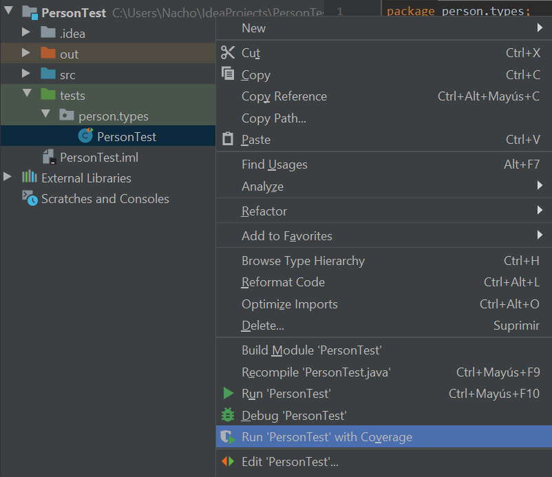
</div>

Then, a new panel with some stats will appear:

<div align="center">
    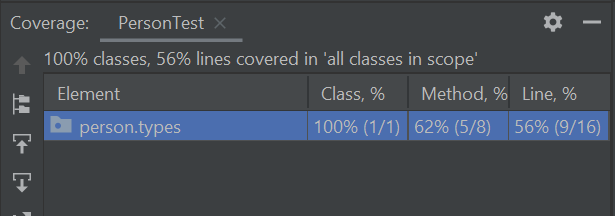
</div>

According to these stats, our test covers 62% of `Person` class. If we edit this class, we can see green, vertical bars in the left margin for lines of code that are being executed, and red, vertical bars for the lines of code that no test is exploring yet.

<div align="center">
    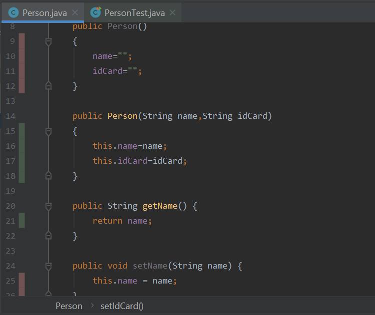
</div>

> **Exercise 1:** 
> 
> Implement the tests for every method of Exercise 4 of [this document](https://nachoiborraies.github.io/entornos/md/en/06b). Use a project called `SalesList` for this purpose, with separate source folders for the original code and the classes.

> **Exercise 2:** 
> 
> Create a new project called `Access`. Implement a class called *Access* with a method called  *validUser(String user,String pass)* that returns *true* if user is valid and *false* if it is not. In order for a user to be valid, it must meet the following conditions:
> 
> * *user* parameter must start with a letter.
> * *user* parameter must have a length between 7 and 10 characters.
> * Password must have a minimum length of 10 characters, and it must have at least one letter and one number.
>
> Design the test cases using the technique of the equivalent partition, and then implement these test cases with JUnit.
 
> **Exercise 3:** 
> 
> Add a new method to the *Access* class: *boolean register(String user, String pass)* that will register the user. The registration will consist in adding the user to a map. There will be a maximum of 10 allowed users in the map, so that if we exceed this limit, the method will return *false*. If the registration is correct, it will return *true*. Also, if a user with the existing name already exists in the map, it will return *false*. You are also asked to implement the tests in JUnit.
