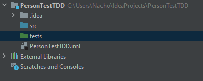
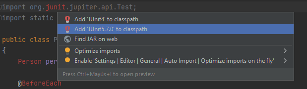
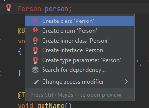
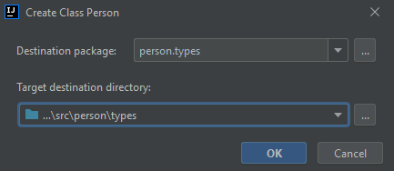
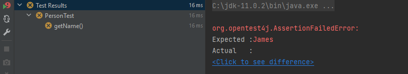
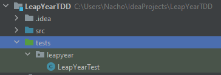

# Software testing

## Introduction to Test Driven Development

<div style="text-align: right">
<a target="_blank" href="slides/10b.html"></a>&nbsp;&nbsp;
<a target="_blank" href="10b.pdf"></a>
</div>

TDD (*Test Driven Development*) is an agile technique (this is, a technique applied in agile software methodologies) to improve code creation in certain cases. It relies on the principle of first defining the test cases, then implement the test methods, and from these test methods, implement the original class to be tested.

In this document we are going to learn some of the basics of this technique, so we can see when it's worth using or not.

### 1. First example: Person class

Let's suppose that we want to create a class called *Person* like the one that we have used in previous example, and we want to test it. According to TDD approach, we should first define the test cases for every possible method of `Person` class, and then implement the code of these methods according to these test cases.

So let's start by creating our project (for instance, *PersonTestTDD*) with our test folder.

<div align="center">
    
</div>

Now, let's suppose that we want to start by checking the `getName()` method of `Person` class. So we add a new test class inside our *tests* folder, including package name.

```java
package person.types;

import org.junit.jupiter.api.Test;
import static org.junit.jupiter.api.Assertions.*;

class PersonTest
{
    @BeforeEach
    void setUp()
    {
        person = new Person("James", "11223344A");
    }

    @Test
    void getName()
    {
        assertNotNull(person.getName());
        assertEquals("James", person.getName());
    }
}
```

We should see some compilation errors now, regarding JUnit library. We can fix them by typing *Alt* + *Enter* over one of the imports and choosing the library to be added:

<div align="center">
    
</div>

Now, there's one more compilation error pending, regarding `Person` class, since this class does not exist yet. If we type *Alt* + *Enter* over this class name, we can choose to create this class:

<div align="center">
    
</div>

In this case, we need to make sure that this new class will be placed in *src* folder (in the same package name than its test class):

<div align="center">
    
</div>

Now, we need to complete the code of this class to, at least, include one parameterized constructor and a `getName` method, so that test class will compile.

```java
package person.types;

public class Person
{
    public Person (String name, String phone)
    {

    }

    public String getName()
    {
        return "";
    }
}
```

Now we can run the test, but it will fail:

<div align="center">
    
</div>

Next step is to fill the code of both constructor and `getName` method to pass this test:

```java
package person.types;

public class Person
{
    private String name;
    private String phone;

    public Person (String name, String phone)
    {
        this.name = name;
        this.phone = phone;
    }

    public String getName()
    {
        return name;
    }
}
```

So, we would go on with next methods of `Person` class: we first implement the test method(s) and then we include the original methods in the tested class to pass the tests.

As you can figure out, this technique can be quite costly if we just want to implement a typical class with their typical attributes, constructors, getters, setters and so on.

### 2. Second example: leap years

So which is the real strength of TDD in agile methodologies? If we use it to implement every class of our project, we may be wasting some time in the process. We can just use this technique in order to face methods whose code is not clear at the beginning. For instance, let's implement a method that checks if a year number corresponds to a leap year or not (this is, a year with 366 days instead of 365).

The conditions for a year to be leap are:

* It must be divisible by 4
* If it's divisible by 100, it must also be divisible by 400

So we could define these test cases:

|Test case|Name|Input|Expected result|
|---|---|---|---|
|TC1|NonDivisible4|2001|false|
|TC2|Divisible4|2012|true|
|TC3|Divisible100Not400|1700|false|
|TC4|Divisible100And400|2000|true|

Let's create a project called *LeapYearTDD*, with a single class called `LeapYear` and an empty method called `isLeap` that receives an integer as parameter and returns a boolean. By default, this method will return `false` for now.

```java
package leapyear;

public class LeapYear
{
    public static boolean isLeap(int year)
    {
        return false;
    }
}
```

Now, let's create the test folder and test class associated to this class:

<div align="center">
    
</div>

We define the test method for `isLeap` method:

```java
package leapyear;

import org.junit.jupiter.api.Test;

import static org.junit.jupiter.api.Assertions.*;

class LeapYearTest
{
    @Test
    void isLeap() 
    {
    }
}
```

Now, we are going to include the test cases designed for this method, one by one:

```java
@Test
void isLeap()
{
    assertFalse(LeapYear.isLeap(2001));
}
```

This first test is going to run, since our method returns *false* by default, so let's go on with next test case:

```java
@Test
void isLeap()
{
    assertFalse(LeapYear.isLeap(2001));
    assertTrue(LeapYear.isLeap(2012));
}
```

This second test fails, because our method is not ready to check if a year number is divisible by 4, so we add this piece of code in the tested class:

```java
package leapyear;

public class LeapYear
{
    public static boolean isLeap(int year)
    {
        if (year % 4 == 0)
            return true;
        else
            return false;
    }
}
```

Now our test succeeds. Let's go on with next test case:

```java
@Test
void isLeap()
{
    assertFalse(LeapYear.isLeap(2001));
    assertTrue(LeapYear.isLeap(2012));
    assertFalse(LeapYear.isLeap(1700));
}
```

Again, our test fails because 1700 is divisible by 4. We need to change the original method to discard years that are divisible by 100:

```java
package leapyear;

public class LeapYear
{
    public static boolean isLeap(int year)
    {
        if (year % 100 == 0)
            return false;
        else if (year % 4 == 0)
            return true;
        else
            return false;
    }
}
```

We add now our last test case:

```java
@Test
void isLeap()
{
    assertFalse(LeapYear.isLeap(2001));
    assertTrue(LeapYear.isLeap(2012));
    assertFalse(LeapYear.isLeap(1700));
    assertTrue(LeapYear.isLeap(2000));
}
```

Our test fails, because 2000 is divisible by 100, but it is a leap year because it's divisible by 400 as well. So we need to include this last condition in our tested method:

```java
package leapyear;

public class LeapYear
{
    public static boolean isLeap(int year)
    {
        if (year % 400 == 0)
            return true;
        else if (year % 100 == 0)
            return false;
        else if (year % 4 == 0)
            return true;
        else
            return false;
    }
}
```

Now our tests are successful. We can finally refactor the code of our tested method to improve it (and pass the tests again to check that everything is OK):

```java
package leapyear;

public class LeapYear
{
    public static boolean isLeap(int year)
    {
        boolean result = false;
        if (year % 4 == 0)
        {
            if (year % 100 != 0 || year % 400 == 0)
                result = true;
        }
        return result;
    }
}
```

### 3. Conclusions

Test Driven Development can be a helpful technique in order to face some algorithms or methods whose code is not clear at the beginning. In this case, the process to be followed is:

1. Design the test cases for the method to be tested
2. Include one test case in our test method
3. Check if method passes the test
4. If not, change the original method to pass the test
5. Go back to step 2 until there are no more test cases left
6. Refactor the code of the final method (we can do this step also in the middle of the process, whenever we feel we can refactor)

> **Exercise 1:**
> 
> Create a project called **PasswordTDD** with a class called `PasswordCheck` and a static method called `check` that receives a password (string) as a parameter and checks if this password is valid or not. A password will be valid if:
>
> * It's between 5 and 10 characters
> * It contains at least one digit
> * It contains at least one lower case letter from a to z
> * It contains at least one upper case letter from A to Z
> 
> Design the test cases for this method and implement its code applying the TDD aproach.

