# Software testing

## Integration tests and continuous integration

<div style="text-align: right">
<a target="_blank" href="slides/10c.html"></a>&nbsp;&nbsp;
<a target="_blank" href="10c.pdf"></a>
</div>

Once the unit tests have been designed and run, it's time to start integrating the different components of the application. This is when continuous integration can come into scene...

### 1. Principles of continuous integration

Continuous integration is a testing methodology that automatically launches a set of tests every time we try to integrate or join the components of an application. This way, every time we make a change in our project and upload the changes, a tool is in charge of launching the tests that we have defined (typically unit tests for each component) and determine if anything is going wrong. This methodology can also be helpful in a team environment, so whenever a team component uploads changes to a common repository, tests are automatically launched and every team member can notice if anything goes wrong.

#### 1.1. Tools for continuous integration

There are several tools that we can use in order to include continuous integration features in our projects. For instance:

* **GitHub Actions** is a tool integrated with GitHub that lets us perform this integration tasks automatically.
* **Travis CI** is an external, open source tool that can be integrated with GitHub so that we can choose which project(s) are included in the continuous integration process.
* **Jenkins** is another external CI tool written in Java that can also be integrated with GitHub and some other control version tools.
* **Circle CI** is another external CI tool that can be integrated with some version control software, such as GitHub.

Some of these tools offer a limited free account that let us perform some integration tests per month. For the purpose of this session, we are going to rely on Circle CI as our preferred tool.

#### 1.2. Using a dependency manager: Gradle

Most of the tools mentioned above use some default configuration files based on some dependency manager. A dependency manager is a tool that automatically looks for dependencies or external resources needed in a project to compile and/or run. Regarding Java projects, we can mention *Gradle* or *Maven* as some of the most relevant dependency managers.

In order to ease the continuous integration in a remote, shared repository, we should create our Java project based on some of these dependency managers. In our case, we are going to use *Gradle* in the example shown in this session. So we create a new IntelliJ project and choose *Gradle* in the first section of the project wizard:

<div align="center">
    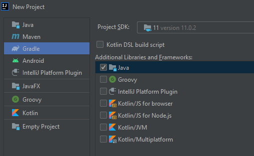
</div>

For the purpose of this session, let's create a project called *SampleCITest*. When we finish creating the project, Gradle will automatically build it for the first time (it may take a few seconds/minutes).

<div align="center">
    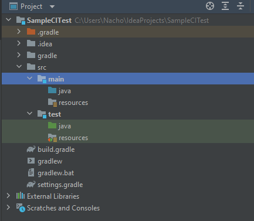
</div>

As you can see, Gradle automatically adds a *src* folder to include our source files, with a subfolder called *main* for the main source code and a *test* subfolder to automatically place the test classes.

Now, let's add a new package called `data` in the *src/main/java* subfolder, with a `Person` class inside with this code:

```java
package data;

public class Person 
{
    private String name;

    public Person(String name) 
    {
        this.name = name;
    }

    public String getName()
    {
        return name;
    }
}
```

Next, click on the class name and press *Alt* + *Enter* to create the associated test:

<div align="center">
    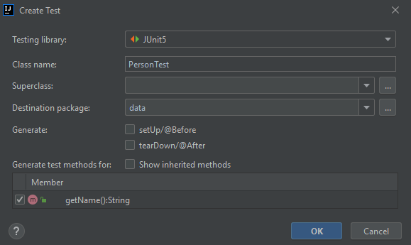
</div>

As you can see, in this case JUnit is automatically included in the project, and we only need to choose the method(s) for which we need to define the tests (`getName` method in this case).

The new test class will be automatically added to *src/tests/java* subfolder. We can fill the code of the test method with something like this:

```java
package data;

import org.junit.jupiter.api.Test;

import static org.junit.jupiter.api.Assertions.*;

class PersonTest 
{
    @Test
    void getName()
    {
        Person p = new Person("James");
        assertEquals("James", p.getName());
    }
}
```

Our project is now ready to be uploaded to a CI environment. Let's go on.

### 2. Using continuous integration with Circle CI

As we have said before, we are going to use *Circle CI* as our CI tool. First of all, we need to sign up in Circle CI home page and enable this tool in our GitHub account. Then, we can easily upload our Java projects with their tests included, and see how it works.

#### 2.1. Circle CI setup

First step in order to use Circle CI is to sign up in its [official web page](https://www.circleci.com/signup), using our GitHub account.

<div align="center">
    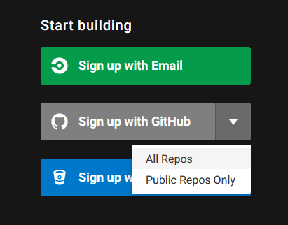
</div>

Then, we need to allow CircleCI from our GitHub account to access our repositories (either public ones, or all of them).

<div align="center">
    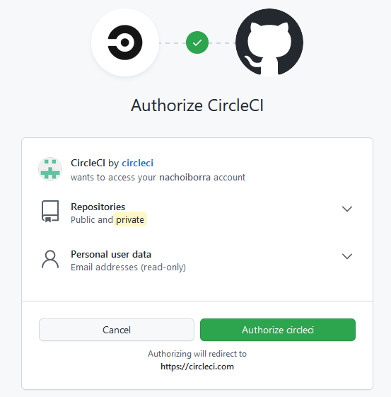
</div>

> **NOTE**: this first step must be done only once, the first time we need to associate our GitHub account with Travis. Then, every repository that we want to include in our continuous integration flow can be automatically added.

#### 2.2. Adding new projects to our CI flow

If we want to add any project to a continuous integration flow, we just need to follow these steps.

**Create the project**

We have already done this step with IntelliJ and Gradle. But, before going on, we could also include a *Circle CI* configuration file in our project, just to ease next steps. Create a directory called `.circleci` in the root folder of the project, and include a `config.yml` inside this folder like the one that you can get [here](../../resources/en/config_yml.zip).

<div align="center">
    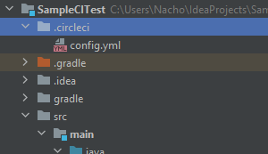
</div>

This *.yml* file tells Circle CI how it should compile the project and run the tests using Gradle.

**Upload the project to GitHub**

[Here](https://nachoiborraies.github.io/entornos/md/en/05d#3-using-git-in-intellij) you can see how to do it but, to sum up, we need to go to *VCS* > *Share project on GitHub*, and then choose the repository name (we may need to enter our credentials if we haven synchronized IntelliJ wigh GitHub yet).

<div align="center">
    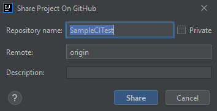
</div>

You will be asked to do an initial commit and *push* with the files of the project.

**Setup project in Circle CI**

Then, go to [Circle CI projects page](https://app.circleci.com/projects/) of your account and choose the project you want to manage. 

<div align="center">
    
</div>

Click on the *Setup Project* button, and choose the *Fastest* option. As you have manually added the `config.yml` file to your project, Circle CI should automatically detect this file in the *master* branch.

<div align="center">
    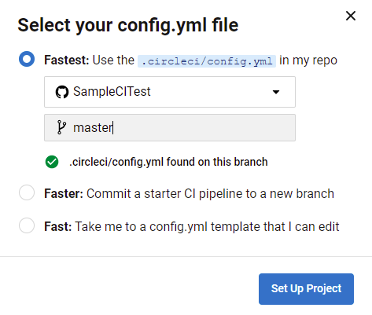
</div>

And that's all. Now your continuous integration process is ready. In the *Dashboard* of Circle CI you can see the history of all the tests performed:

<div align="center">
    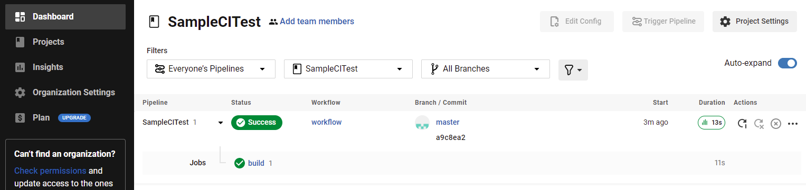
</div>

#### 2.3. Making changes to the project

Whenever we make any change to the project, or add new tests, Circle CI will automatically launch them, so you will see a new entry in the dashboard. For instance, let's add this new assertion to the `getName` test method. Notice that this assertion will make the test fail:

```java
package data;

import org.junit.jupiter.api.Test;

import static org.junit.jupiter.api.Assertions.*;

class PersonTest 
{
    @Test
    void getName()
    {
        Person p = new Person("James");
        assertEquals("James", p.getName());
        assertEquals("John", p.getName());
    }
}
```

Commit and push the changes to GitHub (from *Git* > *Commit* menu, choosing the *Commit and Push* button):

<div align="center">
    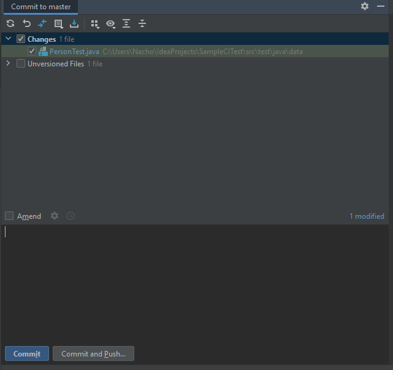
</div>

Now you can see these new tests running automatically on Circle CI dashboard:

<div align="center">
    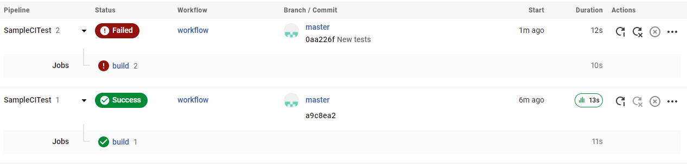
</div>

Also, you will get an e-mail to your GitHub account every time a continuous integration is launched and failed, so you can see the results. Besides, these results are also available from GitHub. If you choose the appropriate repository and branch (*master*, in our case), you will see an icon next to the last commit information (red if any test has failed, green if everything is OK):

<div align="center">
    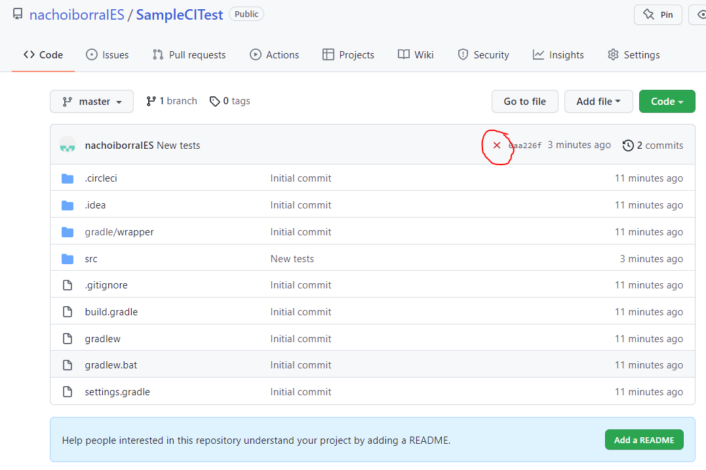
</div>

If we don't want to include Circle CI features in a project any longer, we go back to the projects section in Circle CI web site and choose *Unfollow project*

<div align="center">
    
</div>

> **Exercise 1:**
> 
> Follow the steps shown in this section to create the *SampleCITest* project with the `Person` class. Upload the initial version of the project to GitHub (including `config.yml` file for *Circle CI*) and then add new changes to both `Person` and `PersonTest` classes to include new methods and tests (for instance, the `setName` method). See how the Circle CI dashboard automatically updates with every new test that you include in the project.
