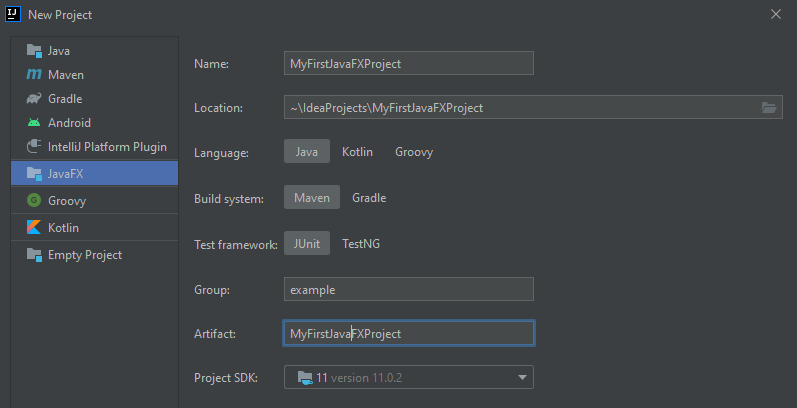
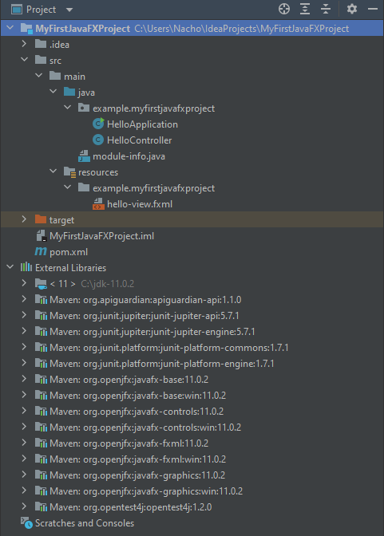
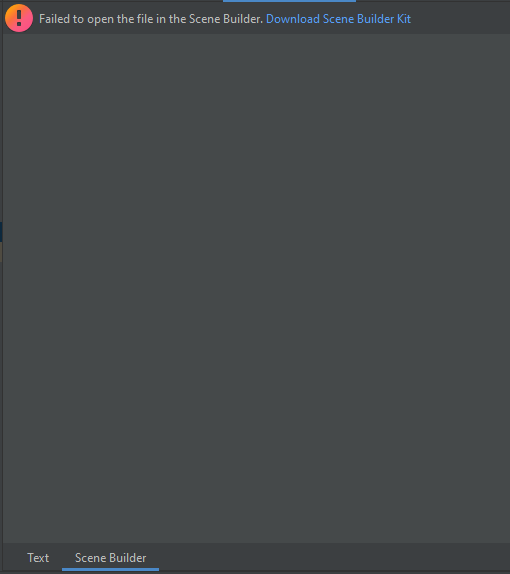
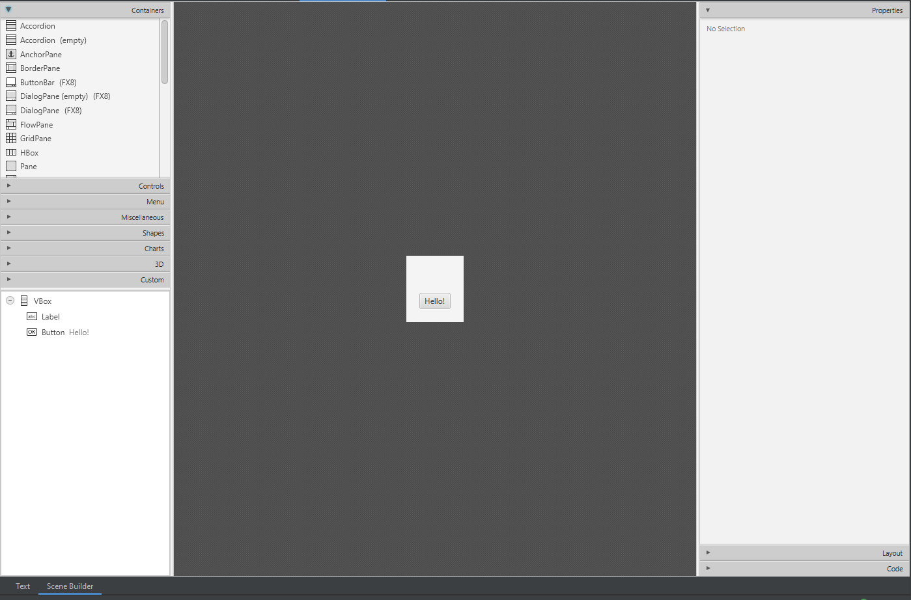
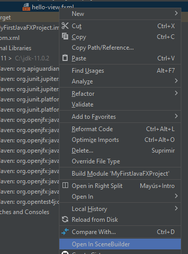
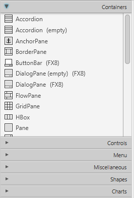
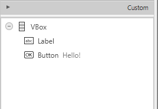
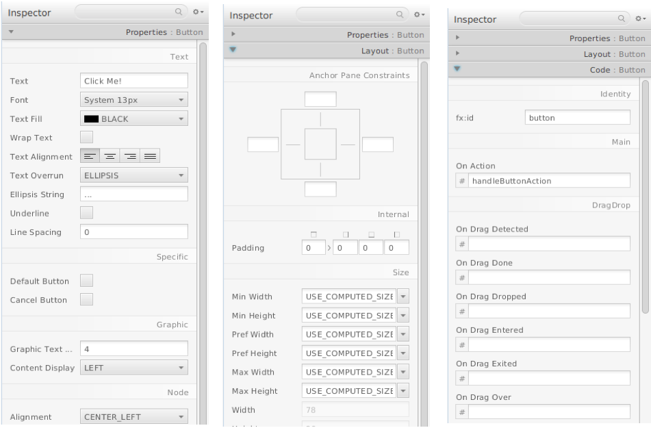

# JavaFX application development

## First steps with JavaFX

<div style="text-align: right">
<a target="_blank" href="slides/13a.html"></a>&nbsp;&nbsp;
<a target="_blank" href="13a.pdf"></a>
</div>

JavaFX is a set of Java packages that lets us create a wide variety of graphical user interfaces (GUI), from the classical ones with typical controls such as labels, buttons, text boxes, menus, and so on, to some advanced and modern applications, with some interesting options such as animations or perspective.

If we look backwards, we can see JavaFX as an evolution of a previous Java library, called Swing, that is still included in the official JDK, although it is becoming quite obsolete, and the possibilities that it offers are much more reduced. That is why now most of the Java desktop applications are being developed with JavaFX. At the beginning, it was distributed as an additional library that we needed to add to our projects. In Java version 8 it was included in Java core, but from version 11 it is, again, a separate library. So we need to download it and link it to our projects. However, it can be integrated with some of the most popular Java IDEs, such as Eclipse, NetBeans or IntelliJ. This allows us to:

* Create JavaFX applications directly from our preferred IDE.
* Run our JavaFX programs on any device that runs Java 8+ applications (desktops, laptops, tablets, mobile phones...)

### 1. Creating a JavaFX project in IntelliJ

> **IMPORTANT NOTE**: the steps explained in this section are updated to IntelliJ version 2021.2.1. These steps are different in earlier versions, and may differ in future versions until we update the contents again. We apologize for this inconvenience, but this is one of the drawbacks of working with JavaFX in many IDEs. In [this section](#3-some-notes-about-previous-versions) you can find some tricks to work with previous versions, although it is harder to set up a JavaFX project this way.

The first step to deal with a JavaFX application is to create a **new project** of type **JavaFX**. You will see a dialog like this:

<div align="center">
    
</div>

Some of the options in the dialog are self-explanatory, but some others may be confusing:

* **Name** and **Location** refer to the IntelliJ project's name and location, as you have done in many other Java applications.
* In **Language** you can choose your project language. In this case we choose *Java*.
* **Build system** refers to the dependency manager that you want to use. A dependency manager is a tool that automatically downloads and incorporates to our project every external dependency, like JavaFX in our case. You can choose between Maven and Gradle, which are the most important Java dependency managers nowadays. You can leave **Maven** as your default manager.
* **Test framework** lets you choose the test library for your application. **JUnit** is maybe the most popular one, so you can leave this option, although we are not going to use it in this unit.
* **Group** refers to a package name which will group your whole project. In the image above we have specified a group *example*. This means that, if our project is called *MyFirstJavaFXproject*, then the main package will be called `example.myfirstjavafxproject`. You can leave this field empty if you don't want to add an additional package to group your project.
* **Artifact** usually corresponds to the project name. It can be used to generate artifacts, such as JAR files containing the application.
* **Project SDK** points to the JDK version that you are going to use (automatically detected, usually).

#### 1.1. JavaFX project structure

After following these steps, a new JavaFX project will be created with this project structure:

<div align="center">
    
</div>

* **.idea** folder contains specific configuration files for the IntelliJ project. We don't need to care about this folder, usually.
* **src** folder contains all the source files of our project. It contains a *main* subfolder with two sections in it:
   * **java** is the main source folder (that's why it is represented in blue). Inside this folder we will place all the Java packages of our application. By default, the contents are placed in the main package, which consist in your group name (specified when creating the project) followed by your project name (`example.myfirstjavafxproject` in our case).
   * **resources** contains all the additional resources for our project that are not source files. In this case, there's a FXML added to the same package than our source files. This lets us separate the code of our application from the design and additional elements, such as images.
* **target** folder contains the generated output when we compile or build the project
* **External Libraries** contains all the libraries required for this project. They are automatically added by Maven.

#### 1.2. Important files in the project

Let's have a look at some of the files contained in the project structure that have a special role:

* **pom.xml** file, located at project's root folder, is the Maven configuration file. This contains all the references to external libraries, such as JavaFX, including versions required. All the required libraries included in this Maven configuration file are automatically added to the **External Libraries** section, at the end of the project, and we don't need to care about them.
* Inside **resources** folder there's an FXML file that contains the elements of our application. This FXML file can be edited manually from IntelliJ, or using a tool called Scene Builder that we will see later. This way, we can add buttons, labels, text fields and many other components to our application.
* Inside **java** folder there's a package with two Java files: one of them is the main application that will be run, and the other one is a *controller*, which is associated with the FXML file contained in the *resources* folder.
* **module-info.java** is a Java modules configuration file, which is located in the main source folder (*java* folder, in this case). It contains a reference to the external libraries required in the code of our application, and the elements of our application that need to be open and/or exported in order to run them. These are the default contents of this file:

```java
module example.myfirstjavafxproject {
    requires javafx.controls;
    requires javafx.fxml;

    opens example.myfirstjavafxproject to javafx.fxml;
    exports example.myfirstjavafxproject;
}
```

#### 1.3. Running the project

If everything is properly set up, we can run the sample project that has been created. The first time we need to right click on the main class (`HelloApplication`) and choose *Run* from the context menu. From this point on, we can just click on the green arrow button in the upper right part of the window to run this same file again.

If you pay attention to this main class, it's a subtype of JavaFX's `Application` class. 

```java
import javafx.application.Application;
import javafx.fxml.FXMLLoader;
import javafx.scene.Scene;
import javafx.stage.Stage;

import java.io.IOException;

public class HelloApplication extends Application 
{
    @Override
    public void start(Stage stage) throws IOException 
    {
        FXMLLoader fxmlLoader = 
            new FXMLLoader(HelloApplication.class.getResource("hello-view.fxml"));
        Scene scene = new Scene(fxmlLoader.load(), 320, 240);
        stage.setTitle("Hello!");
        stage.setScene(scene);
        stage.show();
    }

    public static void main(String[] args) 
    {
        launch();
    }
} 
```

As you can see, the application transforms our FXML view into a Java object (the main scene node containing all the other nodes from the scene), and puts that into a Scene object which will be shown by the Stage object (main window).

> **NOTE**: see how the FXML file is loaded into the application through `HelloApplication.class.getResource` method. This instruction will be really useful to load any additional resource from *resources* folder into our application in later documents.

### 2. Understanding Scene Builder

Scene Builder is an external tool that can be integrated into IntelliJ to create our JavaFX graphical user interfaces (GUI). This tool lets us edit FXML files, making interface design much faster, and keeping the view separated from the rest of the code. 

#### 2.1. Using Scene Builder integrated with IntelliJ

In order to use Scene Builder integrated with our IntelliJ IDE, we must double click on the FXML file that we want to edit. In the main area, we can switch between the text mode (in which we will just see the FXML contents) or the graphical mode through *Scene Builder* tab. This is what you see from the *Text* tab:

```xml
<?xml version="1.0" encoding="UTF-8"?>

<?import javafx.geometry.Insets?>
<?import javafx.scene.control.Label?>
<?import javafx.scene.layout.VBox?>

<?import javafx.scene.control.Button?>
<VBox alignment="CENTER" spacing="20.0" xmlns:fx="http://javafx.com/fxml"
      fx:controller="example.myfirstjavafxproject.HelloController">
    <padding>
        <Insets bottom="20.0" left="20.0" right="20.0" top="20.0"/>
    </padding>

    <Label fx:id="welcomeText"/>
    <Button text="Hello!" onAction="#onHelloButtonClick"/>
</VBox>
```

If you choose the *Scene Builder* tab, Scene Builder plugin will be opened with a default initial view. The first time that we click on this tab we may be asked to install Scene Builder kit, along with JavaFX components in IntelliJ:

<div align="center">
    
</div>

After clicking in the link(s) to download the required software, you may see something like this:

<div align="center">
    
</div>

#### 2.2. Using Scene Builder as a standalone application

You can install Scene Builder as a standalone application (apart from IntelliJ) if you feel that IntelliJ plugin is not working properly. [Here](http://gluonhq.com/labs/scene-builder/) is the official link to install it. Make sure that you choose the appropriate version, depending on your current JDK and JavaFX versions.

If you want to use this standalone application instead of the IntelliJ plugin, you just have to right click on the FXML file from IntelliJ and choose the option *Open in Scene Builder* from the context menu.

<div align="center">
    
</div>

The first time it may ask you to enter the path to the Scene Builder application, which is something like *C:\Users\YourUserName\AppData\Local\SceneBuilder* in Windows. If you choose to work with this standalone version of Scene Builder, remember to save the changes from Scene Builder (menu *File > Save*) so that you can see them updated in your IntelliJ project.

#### 2.3. Scene Builder main window

At the top left part of the application, we have the JavaFX components that we can include in our application. They are divided into some categories, such as containers, controls, menus and so on. We will learn more about these categories in later documents, but with this panel we can find the element we are looking for.

<div align="center">
    
</div>

At the bottom left, you'll see the scene's object's hierarchy. There you can also drag the elements and control which elements are inside other elements.

<div align="center">
    
</div>

At the right part of the application you'll find the current selected object's inspector from which you'll be able to change its properties (visual and code). 

* From the **Properties** tab you can change the text inside the element (for instance, the text of a label or a button), colors, text alignment, font type and size and so on.
* From the **Layout** tab you can change the padding and margin of the element, along with the anchor point, this is, the point of the main container to which the element is anchored, so that if we resize the window, the element will keep the same distance with the chosen anchor point(s).
* From the **Code** tab you can specify the *id* of the object (*fx:id*) to be used in the controller's code, and the method which will be called when an event (example: action on a button) is triggered for that object.

<div align="center">
    
</div>

If you want to add any component to the application, you just need to drag it over the main Scene Builder area, and place it at your desired position. In next documents you will learn about the different components that you can use in JavaFX applications, and how to arrange them properly.
