# JavaFX application development

## Basic JavaFX elements

<div style="text-align: right">
<a target="_blank" href="slides/13b.html"></a>&nbsp;&nbsp;
<a target="_blank" href="13b.pdf"></a>
</div>

Now that we have learnt the basics about creating JavaFX projects and using Scene Builder, let's see the main elements that we can include in these applications. These components can be found in the upper left panel, inside the *Containers* or *Controls* tab, respectively.

### 1. The *Stage* and *Scene* classes

**The *Stage* class**

When we create a JavaFX application, the main class extends the `Application` class, and overrides a `start` method that has a `Stage` object as a parameter. The `Stage` object is a reference to the main container of our application. This will be a window in operating systems like Linux, Windows or Mac OS X, but it can be the full screen if our application runs on a smartphone or a tablet.

The `Stage` class provides some useful methods to change some features (size, behaviour...). Some of the most useful methods are:

* `setTitle(String)`: sets the application title (it is visible in the upper bar of the window).
* `setScene(Scene)`: sets our application scene (where all the controls will be placed). We will learn later that there can be more than one scene in a stage.
* `show`: makes the application (stage) visible, and keeps on running next instructions
* `showAndWait`: makes the application (stage) visible, and waits until it is closed before going on.
* `setMinWidth(double)`, `setMaxWidth(double)`: set the minimum and maximum width (respectively) of the window, so that we will not be able to resize it beyond these limits.
* `setMinHeight(double)`, `setMaxHeight(double)`: set the minimum and maximum height (respectively) of the window, similar to the width methods seen before.
* `getMinWidth`, `getMaxWidth`, `getMinHeight`, `getMaxHeight`: get the maximum or minimum width or height of the application.
* `setFullScreen(boolean)`: sets if our application will run in full screen mode (so it will not be resizable, and there will not be any upper bar), or not.
* `setMaximized(boolean)`: sets if our application is maximized or not.
* `setIconified(boolean)`: sets if our application is iconified (minimized) or not.
* `setResizable(boolean)`: sets if our application is resizable or not.

You can see the full description of `Stage` class in the official [API](https://docs.oracle.com/javase/8/javafx/api/javafx/stage/Stage.html)

For instance, with these lines inside the `start` method we can define the window title, and the maximum and minimum size for our window (if we resize it):

```java
stage.setTitle("Hello World");
stage.setMinimumWidth(200);
stage.setMaximumWidth(500);
stage.setMinimumHeight(100);
stage.setMaximumHeight(400);
```

**The *Scene* class**

Every JavaFX program has (at least) one `Scene` object to hold all the controls of the application. When we create it, we need to specify its main node (the one that *FXMLLoader* returns when we parse an FXML):

```java
FXMLLoader fxmlLoader = 
    new FXMLLoader(HelloApplication.class.getResource("hello-view.fxml"));
Scene scene = new Scene(fxmlLoader.load(), 320, 240);
stage.setScene(scene);
```

Then we can find some useful methods inside `Scene` class, such as:

* `getWidth`, `getHeight`: gets the scene's current width and height
* `getX`, `getY`: gets the scene's current coordinates in the screen (referring its upper left corner)
* `setRoot (Parent)`: sets a new layout manager as the main node for this scene.

A stage can switch among multiple scenes by calling its `setScene` method, as we will see later. You can learn more about the `Scene` class by checking its official [API](https://docs.oracle.com/javase/8/javafx/api/javafx/scene/Scene.html).

### 2. JavaFX containers

Every control that we can place in an application, such as buttons, labels and so on, must be placed inside a **container**, also known as *layout managers*. These components let us arrange the controls in a given way, so that we don't need to take care of placing the components in their positions manually. 

Every JavaFX project that we create starts with a default root container. Depending on the IDE that we are using, this default container can be an *AnchorPane*, *GridPane*, *Vbox*... Some of the most common containers in JavaFX are:

* **HBox** and **VBox**: arrange controls horizontally and vertically (respectively). These two containers have some interesting properties in the right *Properties* tab, such as *Spacing* to automatically separate each control from the rest.

<div align="center">
    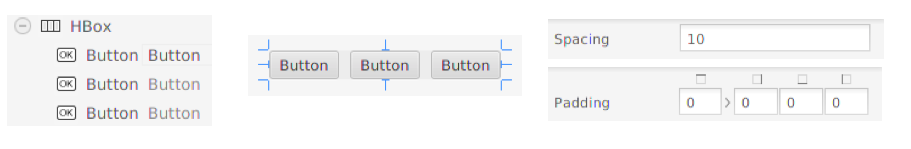
</div>

* **FlowPane**: arranges controls next to each other until there is no more space (vertically or horizontally). Then, it goes to next row (or column, depending on its configuration) to keep on arranging more controls. In a *FlowPane* we can control the space between elements horizontally (Hgap) and vertically (Vgap).

<div align="center">
    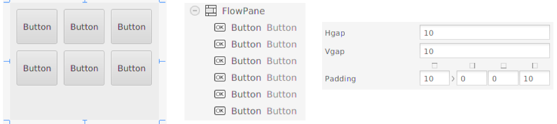
</div>

* **BorderPane**: this layout divides the pane into five regions: top, bottom, left, right and center, and we can add a control (or a container with some controls) in each region.

<div align="center">
    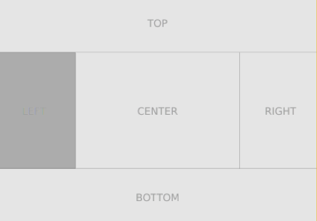
    &nbsp;
    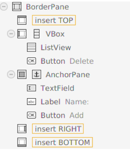
</div>

* **AnchorPane**: this layout enables you to anchor nodes to the top, bottom, left side, right side, or center of the pane. As the window is resized, the nodes maintain their position relative to their anchor point. Nodes can be anchored to more than one position and more than one node can be anchored to the same position. 

<div align="center">
    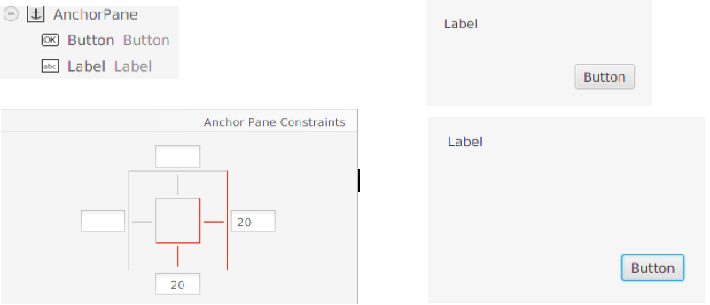
</div>

There are other layout panes, such as *GridPane* (it creates some kind of table in the pane to arrange the controls), *TilePane* (similar to FlowPane, but leaving the same space for each control), and [so on](http://docs.oracle.com/javase/8/javafx/layout-tutorial/builtin_layouts.htm).

### 3. JavaFX controls

Once we have chosen the appropriate container(s) for our application, we need to place the controls inside it/them. It is important to assign an id (*fx:id* from the *Code* tab) to each control that needs to be accessed from the Java code, so that a variable will be created in the corresponding controller.

#### 3.1. Some basic controls

The most common controls that we can find in many JavaFX applications are:

* **Labels**: they display some text in the scene. Once we have put the label inside a container, there are some useful methods in the `Label` class, such as `getText` or `setText`, to get/set the text of the label.
* **Buttons**: they let us click on them to fire some action. We can specify the text of the button either in the constructor or with the corresponding `setText` method, as we do with labels.
* **RadioButtons**: a set of buttons where only one of them can be selected at the same time. We need to define a group (`ToggleGroup` class), and add the radio buttons to it. For instance, if we have three radio buttons to choose three different colors, associated to three variables called `white`, `gray` and `black`, we can add them all to a toggle group and leave one of them selected by default with the following piece of code:

```java
ToggleGroup colorGroup = new ToggleGroup();

white.setToggleGroup(colorGroup);
gray.setToggleGroup(colorGroup);
black.setToggleGroup(colorGroup);

colorGroup.selectToggle(white);
```

* **Checkboxes**: a control that we can check and uncheck, alternatively, every time we click on it. It has the methods `setSelected` and `isSelected` to check/uncheck it, and determine if it is currently checked.
* **Text fields**: Regarding text fields, the most common controls that we can use in our applications are `TextField` (for short text inputs, with a single line), and `TextArea` (for longer texts, with several rows and columns). There are some methods such as `getText` or `setText` to get and set the text of the control, respectively. 

#### 3.2. Working with lists

There are two main types of lists that we can use in any application: `ListView`, with a fixed size where some elements are shown, and dropdown lists. In this last category we can choose between `ChoiceBox` or `ComboBox`. Anyway, we usually use an `ObservableList` of items to add elements to these type of lists. 

```java
list.setItems(
    FXCollections.observableArrayList(
        "Windows", "Linux", "Mac OS X"));
```

We can also get current items and add values to this list:

```java
list.getItems().addAll("Windows", "Linux", "Mac OS X");
```

There are also some useful methods to get the currently selected item(s), or their indexes. If we are using a dropdown list (such as `ChoiceBox` or `ComboBox`), then we can just call `getValue` method to get the currently selected value. We need to typecast it, unless we define the attribute as generic in the controller: 

```java
String value = (String)(list.getValue());
```

If we have a `ListView` get can also use `getSelectionModel` method to access some other additional methods, that let us check or even change currently selected item(s) or index(es).

```java
String element = (String)(myList.getSelectionModel().getSelectedItem());
```

There are some other useful methods inside `getSelectionModel()`, such as `getSelectionModel().getSelectedItems()` (if we allow multiple selection), or `getSelectionModel().getSelectedIndex()` / `getSelectionModel().getSelectedIndexes()` to get the selected index instead of the value itself.

**Lists of objects**

If we want to put some complex objects (such as books, people and so on) in a list, we just need to override `toString` method of the affected class to show the appropriate information of each control in the corresponding list.

#### 3.3. Working with menus

As in many desktop applications, we can add a menu to our JavaFX application (this is not usual when we are developing a mobile application). The pattern that we usually follow is to put a menu bar (with default menus inside that we can edit), define the categories (Menu), and add menu items to the categories.

<div align="center">
    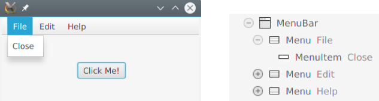
</div>

As you can see, we need to use three different elements when working with menus:

* **MenuBar** to define the bar where all menus and menu items will be placed
* **Menu** to define the categories for the menu items. A category is an item that can be displayed, but it has no action (if we click on it, nothing else happens but showing the items that this category contains).
* **MenuItem** defines each item of our menus. If we click on an item, we can define some code associated to that action, as we will see when talking about events. In the example above we have defined a menu item called "Close" inside File menu. There are also some `MenuItem` subtypes, such as `CheckMenuItem` (items that can be checked/unchecked, like checkboxes), or `RadioMenuItem` (groups of items where only one of them can be checked at the same time, like radio buttons). We can also use a `SeparatorMenuItem` to create a separation line between groups of menu items.

All these elements are available in the *Menu* section in the upper left corner of Scene Builder.

### 4. Placing components and updating the application

Now that we know the most important containers and controls that we can use in a JavaFX application, let's see how to use them with Scene Builder, and how to update the code related with this graphical design.

First of all, we need to choose the appropriate containers and controls and arrange them in Scene Builder. We may need to remove any existing content, and we can do it by right clicking on the corresponding control or container in the lower left panel (*Custom* tab), and choosing *Delete*.

#### 4.1. Synchronizing the controller class

Every FXML file in our JavaFX project has a controller Java class associated, so that every component in this FXML file can be accessed from Java code. When we create a default JavaFX application, the association between the controller class and the FXML file is automatically added in this last file:

```xml
<VBox alignment="CENTER" spacing="20.0" xmlns:fx="http://javafx.com/fxml"
      fx:controller="example.myfirstjavafxproject.HelloController">
    ...
```

However, if we remove the main container and place a new one, this association is lost, and we have to manually add it. For instance, if we replace previous *VBox* controller with an *AnchorPane*, we need to add a `fx:controller` attribute in it with the controller associated:

```xml
<AnchorPane fx:controller="example.myfirstjavafxproject.HelloController" 
...
```

> **NOTE**: this step must ONLY be done with the root container of our application (not with every container that we use).

#### 4.2. Adding elements to the controller

As we add controls and containers to the application in SceneBuilder, they are automatically added to the FXML file but, in order to have them accessible from the controller Java code, we need to assign them an id (*fx:id* property in the *Code* tab of Scene Builder). 

<div align="center">
    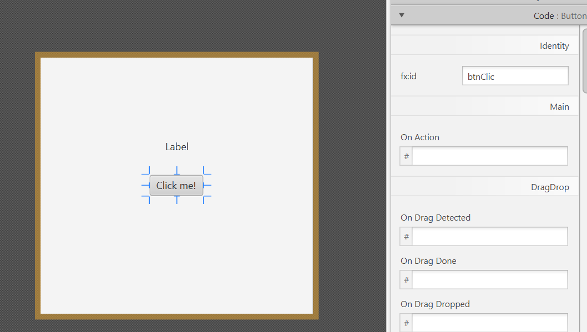
</div>

This *id* will be automatically added to the FXML file, as a property of the corresponding control:

```xml
<Button fx:id="btnClic" layoutX="131.0" layoutY="141.0" 
mnemonicParsing="false" text="Click me!" />
```

Then, we need to manually add this property to the controller class (as long as the controller is properly attached to the FXML file, as we have explained before). To do this, we can just move the mouse over the corresponding attribute in the FXML file, then go to the "bulb" that will be shown and choose *Create field XXX*, where XXX will be the *id* given to our control:

<div align="center">
    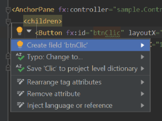
</div>

This is how our controller should look like after this change:

```java
public class HelloController
{
    public Button btnClic;

```

However, the attributes of a class should be private, so we set these controls as private attributes:

```java
public class HelloController
{
    private Button btnClic;

```

This last change will cause an error in our FXML file, since it can't access this private file. To solve it, we just move the mouse over the control name, go to the red bulb on the left margin and choose *Annotate field XXXXX as @FXML*.

<div align="center">
    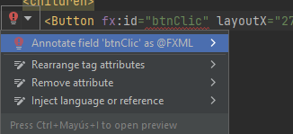
</div>

These steps must be repeated for every control in the FXML file that needs to be accessed from the controller.

#### 4.3. Initializing components

Some components need to be initialized with some default values. For instance, lists may need to be populated with some values at the beginning. If we need to initialize some components in a JavaFX application, then we need to make the controller implement `Initializable` interface:

```java
import javafx.fxml.Initializable;
...
public class HomeController implements Initializable
```

This forces us to add a new method, called `initialize`, where all the initialization code must be placed. This method is called at the beginning, before showing the scene.

```java
public class HomeController implements Initializable
{
    @Override
    public void initialize(URL url, 
        ResourceBundle resourceBundle) 
    {
        
    }
}
```

#### 4.4. Renaming components

Usually, we don't want to use the default names provided by IntelliJ for our FXML and *.java* files. If you want to rename them, it's a good choice to do it at the beginning. Just right click on the file name and choose *Refactor > Rename* menu. Then, type the new name and make sure that every reference is still OK:

* The name of the FXML file loaded in `start` method in the main class
* The name of the controller associated to the FXML file

You may need to add more FXML files and controllers in a complex application, as we will see in next document. In this case, you can decide if you place all the FXML files in the same resources folder, and all the controller classes in the same Java package.

> **Exercise 1:**
> 
> Create a new JavaFX project called **NotepadFX** with the following appearance:

<div align="center">
    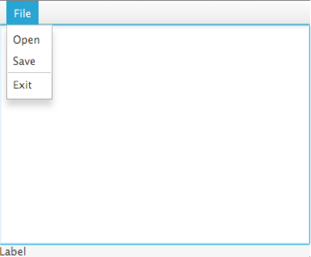
</div>

> You must choose an appropriate container, and place a menu bar at the top, with the *File* menu containing the specified menu items (*Open*, *Save* and *Exit*). Then, place a *TextArea* in the center and a label at the bottom. Once you have finished placing the container(s) and controls, save your project. We will go on with it in later sections.

> **Exercise 2:**
> 
> Create a JavaFX project called **ContactsFX** with the following main window:

<div align="center">
    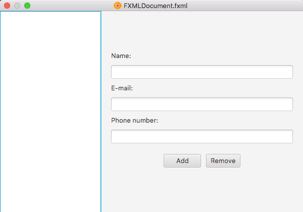
</div>

> There is a list view on the left, and some labels, text fields and buttons on the right. Choose the appropriate containers and controls to get a similar appearance. Save your project when you are done, we will go on with it later.

### 5. Events

If we only add controls to our JavaFX application (buttons, labels, text fields...) we will not be able to do anything but clicking and typing with it. There will be no file loading, data saving, or any operation with the data that we type or add to the application.

In order to allow our application to respond to our clicks and typings, we need to define event handlers. An **event** is something that happens in our application. Clicking the mouse, pressing a key, or even passing a mouse over the application window, are examples of events. An **event handler** is a method (or object with a method) that responds to a given event by executing some instructions. For instance, we can define a handler that, when a user clicks a given button, takes the numerical values from some text boxes, adds them and shows the result.

#### 5.1. Main event types

Every event produced in our application is a subclass of `Event` class. Some of the most common types (subclasses) of events are:

* `ActionEvent`: typically created when the user clicks on a button or a menu item (and also when he tabs to the button or menu item and presses the Enter key).
* `KeyEvent`: created when the user presses a key
* `MouseEvent`: created when the user does something with the mouse (click a button, move the mouse...)
* `WindowEvent`: created when the status of the window changes (for instance, it is maximized, minimized, or closed).

#### 5.2. Defining handlers through Scene Builder

Most common events (but not all) can be connected to an event handler with Scene Builder (FXML). In order to do that, we select the element and in the right (*Code* tab) we will see the different event types we can bind to a method in the controller.

<div align="center">
    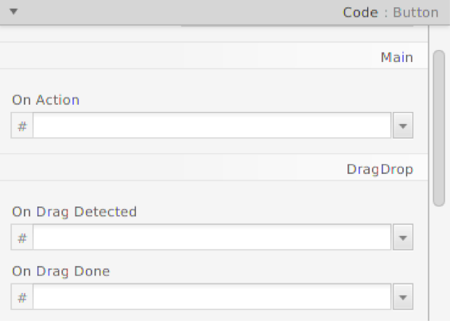
</div>

We need to type the handler name in the desired event, save the changes manually add the corresponding method to the controller (as we did for the *fx:ids* of the components before, going to the "bulb" and choosing *Create method...* option). Then, a new event handler will appear in the code:

```java
private void handleButton(ActionEvent event) 
{
    // Code
}
```

Now, we just need to type the code associated to this handler.

#### 5.3. Defining handlers by code

We can also define our event handlers in the code of the controller. This can be typically done in the `initialize` method, where every component is initialized as the application starts. Let's see some examples.

**Action event over a button**

This way we could define an action event over a button whose variable name is `button`:

```java
@Override
public void initialize(URL url, ResourceBundle rb) 
{
    ...
    button.setOnAction(new EventHandler<ActionEvent>() 
    {
        @Override
        public void handle(ActionEvent event) 
        {
            // Code
        }
    });
} 
```

**Event over a list view to detect selection changes**

This way we could fire an event whenever we change the currently selected item of a list view (in this case, it is a list view of `String` elements):

```java
listView.getSelectionModel().selectedItemProperty().addListener(
    new ChangeListener<String>() 
    {
        @Override
        public void changed(ObservableValue<? extends String> obs, 
                            String oldValue, String newValue) 
        {
            // "newValue" contains the new selected item
            // and "oldValue" the previously selected one
        }
    }
);
```

> **Exercise 3:**
> 
> Follow the steps shown in [this video](https://youtu.be/PJmU7EmjOKM) to complete a project called **CalculatorFX**.

> **Exercise 4:**
> 
> Create a project called **CurrencyConverter** that allows us to convert between three different types of currencies: euro (EUR), dollar (USD) and british pound (GBP). There will be a menu to choose one of the six possible combinations, by using *RadioMenuItems*: EUR>USD (default option), EUR>GBP, USD>EUR, USD>GBP, GBP>EUR and GBP>USD. Below that, there will be a text field, and a label. Everytime we type anything in the text field, the program must convert the amount automatically to the given currency, and show the result in the label. For instance, if we have chosen EUR>GBP, and we know that 1 EUR = 0.8 GBP, then when we type "12" in the text field, the program should look like this:

<div align="center">
    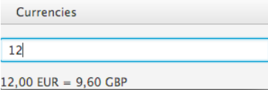
</div>

> To complete the application, add an *ActionEvent* to each *RadioButtonItem* that clears the text in the text field and label, to start a new conversion with new currencies.
>
> In order to help you finish the program, assume that the currency exchanges are as follows:
>
> * 1 EUR = 1.10 USD
> * 1 EUR = 0.8 GBP
> * 1 USD = 0.7 GBP

> **Exercise 5:**
> 
> Complete *NotepadFX* project from previous exercises by adding these events:
> 
> * If we choose *File > Open* menu item, then the program will read a text file called "notes.txt" and write the text in the text area. Besides, the bottom label must show how many line have been read from the text file.
> * If we choose *File > Save* menu item, the program will get the text of the text area and save it in the *notes.txt* file, erasing any previous content of this file. The bottom label must show a message indicating if the file has been successfully saved or not.
> * If we choose *File > Exit* menu item, the application will close.

> **Exercise 6:**
> 
> Complete *ContactsFX* project from previous exercises with these events:
> 
> * At the beginning (in the `initialize` method), the program will load a list of contacts from a text file called "contacts.txt" (create a `Contact` class for this purpose) and show it in the left list view.
> * Whenever we select any contact from the list view, his information will be shown in the corresponding text fields of the right part of the window.
> * If we click on the *Add* button, then a new Contact with the information of the text fields will be created, and added to the list. Also, the new contacts list will be saved in "contacts.txt" file, erasing any previous contents of the file.
> * If we click on the *Remove* button, then the currently selected contact from the list (if any) will be removed, and the corresponding text file will be updated.

### 6. Using dialogs

Since JavaFX 8 (or rather, since JavaFX version 8u40) there are some built-in dialogs available for JavaFX. Some of them show information messages or confirmation dialogs. Most of these dialogs can be built from the `Alert` class. It has methods to define the dialog title, header and content, although all these messages are optional. The basic usage of this class is to show basic messages, such as error messages, or information messages.

```java
Alert dialog = new Alert(AlertType.ERROR);
dialog.setTitle("Error");
dialog.setHeaderText("Error loading data");
dialog.setContentText("File 'data.txt' not found");
dialog.showAndWait();
```

<div align="center">
    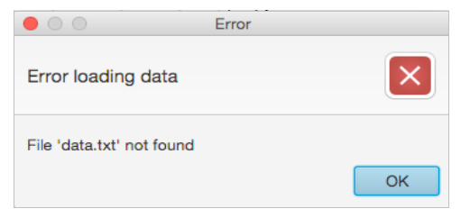
</div>

We can change the parameter of the constructor (`AlertType.ERROR`) for any other constant from `AlertType` class, such as `CONFIRMATION`, `WARNING`, `INFORMATION`... If we use a `CONFIRMATION` dialog, then two buttons will be shown:

```java
Alert dialog = new Alert(AlertType.CONFIRMATION);
dialog.setTitle("Confirmation");
dialog.setHeaderText("");
dialog.setContentText("Are you sure you want to close the application?");
Optional<ButtonType> result = dialog.showAndWait();

if (result.get() == ButtonType.OK)
    // Code for "OK"
else
    // Code for "Cancel"
```

<div align="center">
    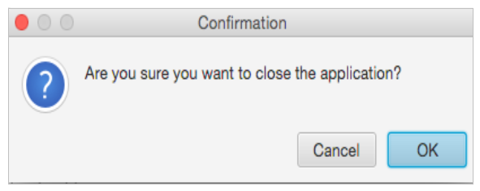
</div>

If we choose the "OK" button, then a value will be returned. Otherwise (if we click on the cancel button, or we close the dialog), no value will be returned. We can store this in an `Optional` value to check the confirmation result.

#### 6.1. Dialogs for file choosing

Another built-in dialog since JavaFX 2.0 is the `FileChooser` dialog. We use it to display a dialog box to make the user choose a file to open/save data from/into. To use this dialog, we can just add these lines to our code:

```java
FileChooser fileChooser = new FileChooser();
fileChooser.setTitle("Open Resource File");
File selectedFile = fileChooser.showOpenDialog(stage);
```

There is also a `showSaveDialog` method to let the user save some data into a file, and some other useful methods (check the API for more details).

There are also some other built-in dialogs that may be useful. For instance, we can customize the confirmation dialog with more buttons, and we can create some other dialog types, such as text input dialogs (with `TextInputDialog` class, to ask the user to introduce some text), or choice dialogs (with `ChoiceDialog` class, to make the user choose among a list of options). You can look for more examples [here](http://code.makery.ch/blog/javafx-dialogs-official/).

> **Exercise 7:**
>
> Improve *NotepadFX* project by adding a *FileChooser* dialog to let us choose the file to be read or saved from the application, when we choose *File > Open* and *File > Save* menu items, respectively.

> **Exercise 8:**
> 
> Improve *ContactsFX* project by adding some alerts:
> 
> * Show an error alert if we try to add a new contact with some empty field.
> * Show an information alert if the contact has been successfully added to the list.
