# JavaFX application development

## Building complex JavaFX applications

<div style="text-align: right">
<a target="_blank" href="slides/13c.html"></a>&nbsp;&nbsp;
<a target="_blank" href="13c.pdf"></a>
</div>

In this document we are going to learn some advanced concepts that we need to know if we want to create more complex applications using JavaFX.

### 1. Closing window event

If the user tries to close the application window with the close button of the upper bar (or typing `Alt` + `F4` or any other shortcut), our efforts to try to save the data before closing, or get a confirmation from the user before exiting the program will be skipped.

But do not worry. There is a way of catching this event and redirect it to our control methods. However, we’ll need to start the application in a different way, so we can get a reference to the controller from the main application class. In the `start` method of the application (from the main class), we do something like this:

```java
public void start(Stage primaryStage) throws Exception 
{
    FXMLLoader loader = new FXMLLoader(...);
    Parent root = loader.load();

    Controller controller = (Controller)loader.getController();
    controller.setOnCloseListener(primaryStage);

    primaryStage.setTitle("Hello World");
    ...
}
```

We can see that once we have a reference to our controller, we can call a method that we have created and named `setOnCloseListener`, passing the stage as an argument. This is how this method is implemented in the controller:

```java
public void setOnCloseListener(Stage stage)
{
    stage.setOnCloseRequest(e ->
    {
        // This way we can prevent window from closing
        e.consume();
    });
}
```

If we want to avoid window closing, we just use the `consume` method of the event, just to consume the event with no effects. Otherwise, we can also save some data before letting the window close.

### 2. Changing the default appearance with CSS

We can change the default, old fashioned appearance of our applications by adding styles through CSS documents. This is a file type very used in web design, and we are not going to learn CSS now, since we assume that you have an idea of what it is and how it works. We are going to see how to add these files to our JavaFX applications.

First of all, we need to add a CSS file to our project. To do this, go to *File* > *New*, and select *File*. Then, create a new file with `.css` extension in your source folder (inside your desired package). Then, we can add the styles to our CSS file. There is a special naming that we need to follow in order to set the styles to the appropriate controls. For instance, if we want to apply general styles to all the elements of the application (such as background color, font styles...) we use the `root` class selector:

```css
.root
{
   -fx-background-color: lightgray;
   -fx-font-family: "Arial";
}
```

Notice that every CSS style begins with the `-fx-` prefix, followed by the typical CSS style name (`background-color`, `font-family`...). There are also some other class selectors that we can use to apply styles to some specific controls (buttons, labels...). For instance, this style is applied to every button of our application:

```css
.button {
   -fx-background-color: #A22E15;
   -fx-color: white;
}
```

We can also define our own class or id selectors, such as

```css
.myButton { ... }
#myID { ... }
```

Then, if we want to apply these styles to some selected controls, we need to assign them the corresponding class or id, from Scene Builder. We can also aggregate individual CSS properties there, or even attach a CSS style sheet file to an element an its descendants. All of this can be found inside the *Properties* panel in the right side, inside a CSS section.

Once we have our CSS file created, we can add it to a scene by adding it to the main (root) container of the application (the style sheet is also applied to elements inside it).

<div align="center">
    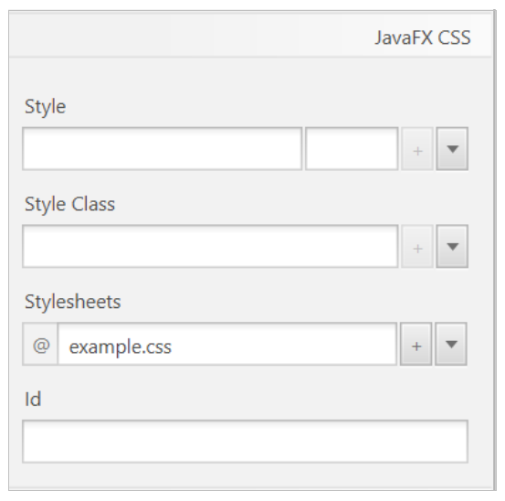
</div>

Alternatively, we can also attach the CSS file to the scene with this line of code in the main application class’ `start` method (the path to the CSS file is relative to the main class package):

```java
Scene scene = new Scene(root);
scene.getStylesheets().add(
    getClass().getResource("MyStyle.css").toExternalForm());
```

[Here](http://docs.oracle.com/javase/8/javafx/api/javafx/scene/doc-files/cssref.html) you can learn more about the official JavaFX CSS reference.

> **Exercise 1:**
>
> Create a project called **CalculatorCSS**, that will be a copy of project *Calculator* from previous document. Change its default style by using a CSS file that sets the background color of the whole application to black, the labels' text color to white, and the font family to Courier New. At the end, your application should look like this:

<div align="center">
    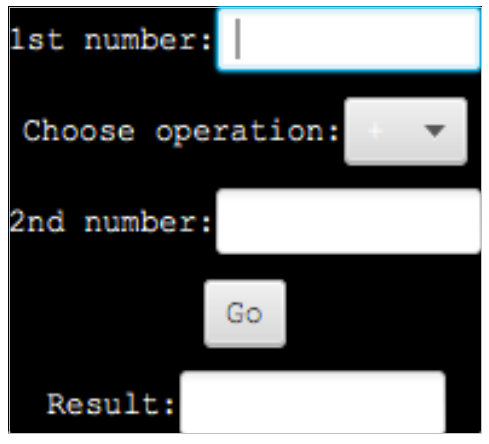
</div>

### 3. Applications with multiple views

It is also useful to create applications with multiple views that can be easily swapped. For instance, an application with a login screen and a main screen. Let's see how it works with an example: create a new JavaFX project called *MultipleViews*. Rename default FXML file to *main.fxml* and create a view like this. 

<div align="center">
    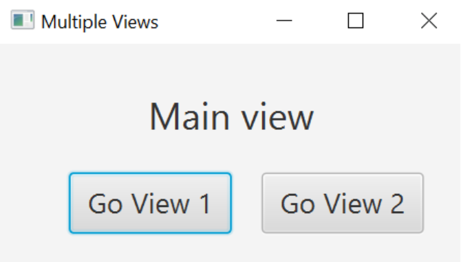
</div>

We'll have two other views that will be loaded from this one. We must create a new FXML file to each new screen (call them *view1.fxml* and *view2.fxml*). Each FXML file is associated to a Controller class, that you have to create. The other two views will look like this:

<div align="center">
    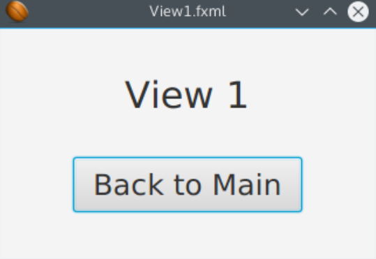
</div>

In the “Go View 1” button's action event method from main scene, we'll just need to load the FXML of the view we want to load, and replace what is shown in the main window with that.

```java
void goToView1(ActionEvent event) throws IOException
{
    Parent root = FXMLLoader.load(
        HelloApplication.class.getResource("view1.fxml"));
    Scene view1Scene = new Scene(root);
    Stage stage = 
        (Stage)((Node) event.getSource()).getScene().getWindow();
    stage.setScene(view1Scene);
    stage.show();
}
```

As the code is mostly the same for all the views, we could create a class to manage these view changes (maybe with a static method or using inheritance).

```java
public class SceneLoader
{
    public static void loadScreen(String viewPath, Stage stage)
    throws IOException
    {
        Parent root = FXMLLoader.load(
            HelloApplication.class.getResource(viewPath));
        Scene viewScene = new Scene(root);
        stage.setScene(viewScene);
        stage.show();
    }
}
```

Then, we can use this class as shown below:

```java
void goToView1(ActionEvent event) throws IOException
{
    ScreenLoader.loadScreen("view1.fxml", 
        (Stage)((Node) event.getSource()).getScene().getWindow());
}
```

We can then apply the same pattern to "Go View 2" and "Back to Main" buttons. Of course we can make it a better and more organized code, but for this example or a simple application it should be enough.

> **Exercise 2:** 
> 
> Complete the example above by adding the events to change the view in every pending button.

#### 3.1. Loading views in different stages

Sometimes it may be useful to add a scene in a different stage that pops up over current stage, so that we can't go back to the main stage unless we close this new one. They are called *modal dialogs*.

In order to define a new scene (a new FXML file) in a different stage, we must do something like this:

```java
// 1. Load FXML file for the new scene
Parent view = FXMLLoader.load(HelloApplication.class.getResource("newApp.fxml"));
// 2. Attach FXML to a new scene
Scene viewScene = new Scene(view);
// 3. Get current main stage
Stage stage=
    (Stage) ((Node) actionEvent.getSource()).getScene().getWindow();
// 4. Create a new stage with the new scene
Stage secondaryStage= new Stage();
secondaryStage.setScene(viewScene);
// 5. Set it as a modal stage and attach it to the main stage
secondaryStage.initModality(Modality.WINDOW_MODAL);
secondaryStage.initOwner(stage);
// 6. Define close event for modal stage and show it
secondaryStage.setOnCloseRequest(e -> // Do whatever);
secondaryStage.show();
```

### 4. Using charts

Charts let us represent the information in a graphical, summarized way that is often much more understandable than just reading a table of data. You can find some different chart types in the chart list of Scene Builder.

<div align="center">
    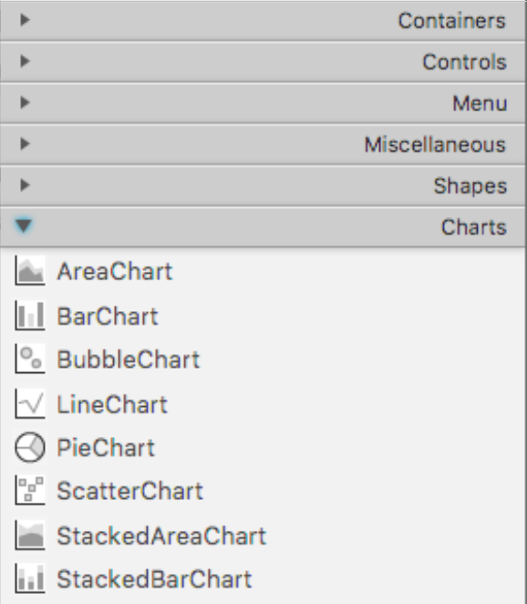
</div>

To use any of them, we just drag and drop it to the scene, like we do with any other common control. Depending on the chart type, it has some specific attributes and methods to provide the data. [Here](https://docs.oracle.com/javase/8/javafx/user-interface-tutorial/charts.htm) you can have a look at some tutorials.

For instance, if we are working with a `BarChart`, we need to clarify the data type for the X axis (categories) and for the Y axis (values). If we want to represent something like this:

<div align="center">
    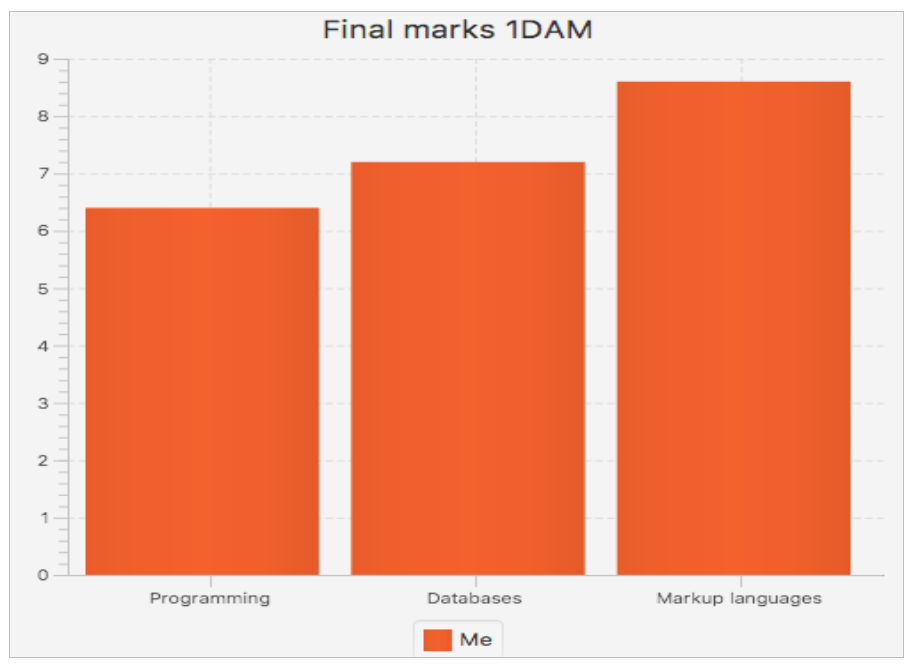
</div>

Then we need to associate this BarChart element to our controller, and set an appropriate name for it (for instance, `chart`). After doing this, in the controller, we need to specify the data type of the X axis (categories) and the Y axis (numbers):

```java
@FXML
private BarChart<String, Number> chart;
```

We can fill the chart with some static data, such as predefined arrays. To create every single bar, we need to create an instance of a `XYChart.Data` object, and fill a `XYChart.Series` object with them.

```java
String[] categories = {"Programming", "Databases", "Markup languages"};
double[] marks = { 6.4, 7.2, 8.6 };

chart.setTitle("Final marks 1DAM");

XYChart.Series data = new XYChart.Series();
data.setName("Me");
for (int i = 0; i < categories.length; i++)
{
    data.getData().add(new XYChart.Data(categories[i], marks[i]));
}

chart.getData().add(data);
```

As you can see, we can also define a main title for the chart. You may also notice that we can add as many series as we need. Each one will be represented with a different bar color.

> **Exercise 3:**
>
> This is the list of average temperatures for every month in Alicante during 2017.

|Jan|Feb|Mar|Apr|May|Jun|Jul|Aug|Sep|Oct|Nov|Dec|
|---|---|---|---|---|---|---|---|---|---|---|---|
|9|8|14|17|21|24|28|30|26|21|16|11|

> Create a new JavaFX FXML project called Temperatures and add a bar chart (`BarChart` control) to it to represent this array. At the end, you should see something like this when launching the application:

<div align="center">
    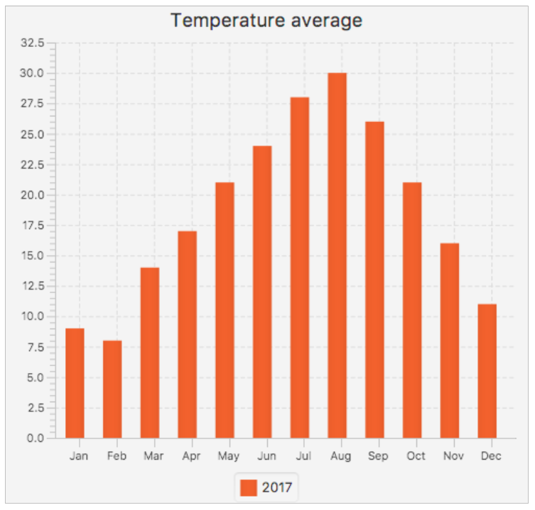
</div>

### 5. Some advanced controls

Apart from the list of basic controls that we can place in JavaFX applications, that have been explained in previous document, there are some controls that need some special setup, or that are not so basic.

#### 5.1. Working with tables

There is a very useful control that we can use when we work with large amounts of data, or with some structured data that we need to keep visible at the same time: tables. This control lets us arrange the information so that we can show different registers in different rows, and different information about the same register in different columns.

To deal with tables, we will use the `TableView` control. We can define the column headers with the `TableColumn` class. For instance, if we want to manage a list of books with their ISBN, title and author, we would create a table like this one:

<div align="center">
    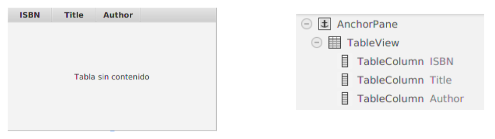
</div>

Once we have our table created, we may need to fill it with some data that we have previously stored. It is recommended to create a class (a public class) that stores every object of the table (every row), and associate each column to an attribute of this class. In our previous example, if we want to work with books, we can create a `Book` class with three attributes (ISBN, title and author), and their corresponding getters and setters:

```java
public class Book
{
    String isbn, title, author;

    public Book (String isbn, String title, String author)
    {
        this.isbn = isbn;
        this.title = title;
        this.author = author;
    }

    public String getIsbn()
    {
        return isbn;
    }

    public void setIsbn(String isbn)
    {
        this.isbn = isbn;
    }

    //... Rest of getters and setters
}
```

Once we have defined our object class, we can create or load a collection of books with our `FXCollections` class, as we did in previous examples:

```java
ObservableList<Book> data = FXCollections.observableArrayList(
    new Book("111111", "Ender's game", "Orson Scott Card"),
    new Book("222222", "The adventures of Tom Sawyer", "Mark Twain"),
    new Book("333333", "The never ending story", "Michael Ende")
);
table.setItems(data);
```

Adding new rows to a TableView is as easy as adding new objects to the list associated to it. In our example, whenever we add or remove data to our observable list (variable `data`), the `TableView` will be automatically updated. 

We can use the `add` method from `ObservableList` interface to add elements to the list:

```java
data.add(new Book("44444", "Misery", "Stephen King"));
```

We can also use the `remove` method to remove an element (or a set of elements) from a given position (or range). This line removes the last element of the list/table:

```java
data.remove(data.size()-1);
```

In order to check which element (row) of the table is currently selected, we can use the same methods that we used with `ListView` control. Typically, we will get the index of the currently selected item, and get the whole object from the arraylist:

```java
int index = table.getSelectionModel().getSelectedIndex();
Book selBook = data.get(index);
```

**Setting up the columns**

In order to specify the value that will be shown in each column of our table, we need to associate every table column (apart from the table itself) with an attribute in our controller. For every *TableColumn* attribute we need to define the type of items the table is going to hold (`Book`), and for each column, we also specify the type of data it will show (`String`, `Integer`,...).

```java
@FXML 
private TableView<Book> table;
@FXML 
private TableColumn<Book, String> colIsbn;
@FXML 
private TableColumn<Book, String> colTitle;
@FXML 
private TableColumn<Book, String> colAuthor;

public void initialize()
{
    // Text to show when the table is empty
    table.setPlaceholder(new Label("No items to show..."));
}
```

We also attach each book property to a given TableColumn object, in the `initialize` method.

```java
colIsbn.setCellValueFactory(new PropertyValueFactory("isbn"));
colTitle.setCellValueFactory(new PropertyValueFactory("title"));
colAuthor.setCellValueFactory(new PropertyValueFactory("author"));
```

> **NOTE:** it is important that we use the same name in the parameter of `PropertyValueFactory` than a corresponding getter but without the prefix "get". For instance, if we create a method called `getTotalPrice()`, we should use the name “totalPrice” in the column to show this value. In other words, *PropertyValueFactory* refers to class getters, not attributes.

#### 5.2. Date pickers

The `DatePicker` JavaFX control allows the user to select a date from a pop-up calendar that appears when we click its button on the right.

We can access the `TextField` inside the DatePicker control using the `getEditor()` method. Once we have access to that text field, we can get its value easily. We can also get the `LocalDate` object representing the current selected date using `getValue()`.

```java
// By default today is selected
datepicker.setValue(LocalDate.now()); 
...
LocalDate date = datepicker.getValue();
```

#### 5.3. Adding images

It is very usual to add some images to our application to make some controls (or the general appearance) more appealing. To do this, we use the `Image` and `ImageView` classes (from `javafx.scene.image` package). The first one allows us to load an image from a file. The `ImageView` class adapts the image loaded to something drawable in our application.

In order to attach an `Image` object (loaded from a file) to an `ImageView` control, we can follow these steps:

Firs of all, we need to load the image in the `Image` file. We can use `getResource` method seen in previous documents, or `getResourceAsStream`, when we loaded initial FXML file in the main class. The path to this image can be written as an absolute path from source folder's root:

```java
Image image = new Image (
    getClass().getResourceAsStream("/sample/img/javafx.png"));
```

Also, we can define an absolute path from project's root folder:

```java
Image image = new Image ("file:src/sample/img/javafx.png");
```

Finally, we can make use of main class' `getResourceAsStream` method to locate these images. For instance, if main class is placed at package `myapplication` and we have the images placed in the same package (inside *resources* folder), we can just do this:


```java
Image image = new Image (MyMainClass.class.getResource("javafx.png"));
```

> **NOTE**: this last example will work as long as image file is located in the same package than main class (although they can be in different source or resource folders).

Once we have our image loaded in an `Image` object, we just need to set this image in the `ImageView` control. For instance, if this control is associated to a variable called `imgFX`, we can do it like this:

```java
imgFX.setImage(image);
```

### 6. Example: *HealthyMenu*

To support our learning of JavaFX and Scene Builder, we’ll build a small application from scratch. This application will have two views: one to show and edit the data, and another one to show a chart that summarizes current data. To begin with, let's create a new JavaFX project called **HealthyMenu**. Rename the default files as follows:

* Default FXML file will be renamed to `main.fxml`
* Default main application class will be `HealthyMenu`
* Default initial controller will be `MainController`. Make sure FXML file has this controller associated at every moment.

All the classes will belong to a main package called `healthymenu`, and the FXML will be placed in this same package (in the *resources* folder). Then, follow the steps given in next subsections.

#### 6.1. Layout for the main view

The main FXML view will have the following appearance:

<div align="center">
    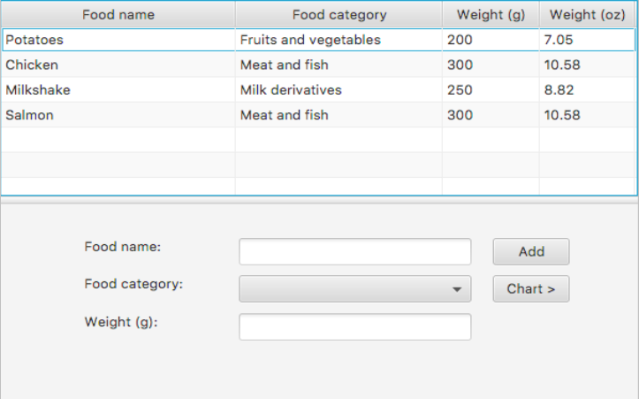
</div>

To get this appearance, we can, for instance, set a vertical `SplitPane` as the main layout. By default, it will have two `AnchorPanes` as layout managers for its two halves. That's ok for us, although we can change them anyway.

**Defining the table**

At the top half of the split pane, let's add a `TableView`. In order to make it fit the total size of the `AnchorPane`, right click on the table view and choose *Fit to Parent* option...

<div align="center">
    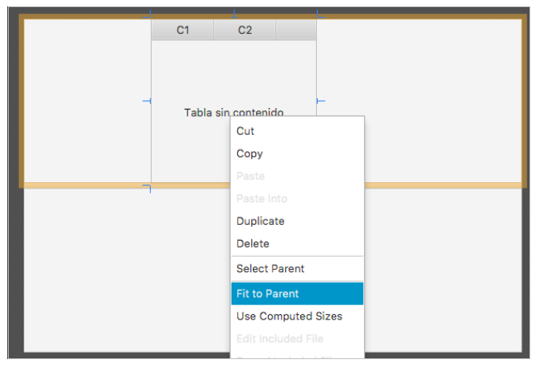
</div>

The table will have four columns:

* The name of a food that we have eaten. For instance, "Tomatoes", or "Milk".
* The food category, that will be chosen among a pre-defined set of values: "*Fruits and vegetables*", "*Meat and fish*", "*Milk derivatives*" and "*Other*".
* The amount of food in grams.
* The amount of food in ounces (oz), that will be automatically calculated from previous column.

In order to set the header of these four columns, we just need to add as many `TableColumn` elements to the table as we need:

<div align="center">
    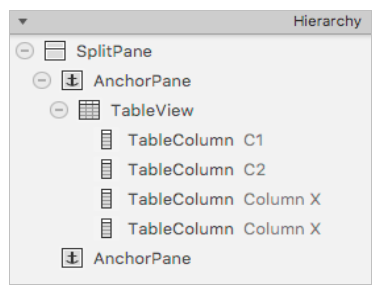
</div>

Then, we click on each `TableColumn` in the left panel, and change its properties in the right panel. For instance, for the first column, we change its *Text* property to "Food name"...

<div align="center">
    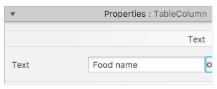
</div>

... and its fx:id property to reference it from our code:

<div align="center">
    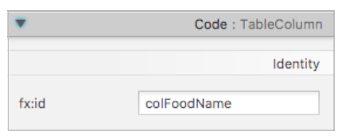
</div>

After changing these properties for the four columns, you'll get this table:

<div align="center">
    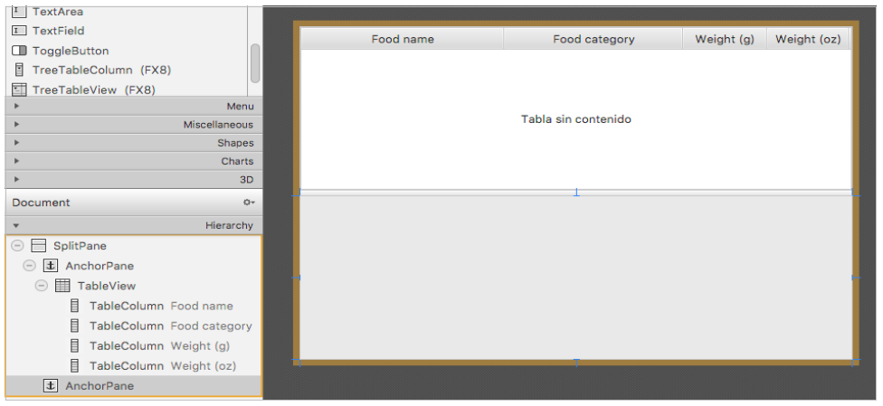
</div>

**Defining the bottom form**

The bottom form will let us add food to the upper table. We will need the following form fields:

* A text field to specify the food name (with its associated label)
* A choice box to choose the food category (with its associated label)
* Another text field to set the weight in grams (with its associated label)
* A button to add the data to the table

Let's start by adding each pair of label and associated field. For the first pair (food name), we start by adding the label, and then the text field next to it. As you can see when you move an item near others or near the borders of a container, there are some auxiliary lines that will help you align that item with the same margin as others or put some items in line. At the end, you should get something like this:

<div align="center">
    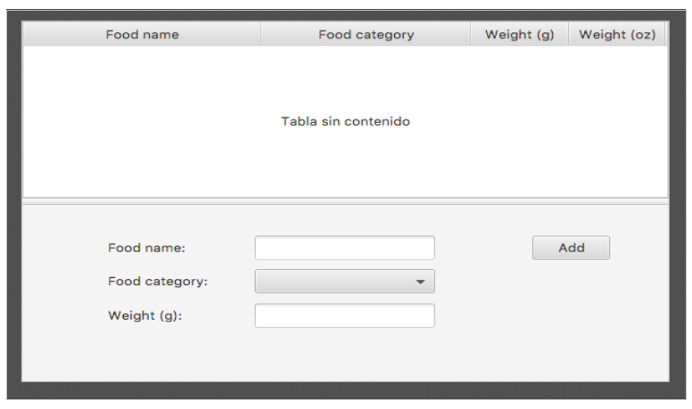
</div>

For this example, we have associated the food name text field, weight text field, choice box and button with these *fx:ids*, respectively: `txtFoodName`, `choiceCategory`, `txtWeight` and `btnAdd`. Associate each control an appropriate fx:id and update the controller.

Now, we need to fill the choice box with the pre-defined list of possible values. First of all, specify the data type of the choice box in the controller:

```java
private ChoiceBox<String> choiceCategory;
```

Then, add these lines to the `initialize` method of the main controller:

```java
choiceCategory.setItems(FXCollections.observableArrayList(
    "Fruits and vegetables", "Meat and fish",
    "Milk derivatives", "Other"));
```

To help the form resize with the window, first we'll have to tell the controls how to resize. It can be helpful to wrap some controls in a *HBox* or *VBox* layout manager, in order to treat them as a whole. For instance, we wrap the Food name label, its associated text field and the Add button in a *HBox*. To group them inside an HBox, select all the controls involved (click them while pressing *shift* key), and in the menu select *Arrange* → *Wrap in* → *HBox*. You can also activate this menu by right-clicking on the selection itself.

<div align="center">
    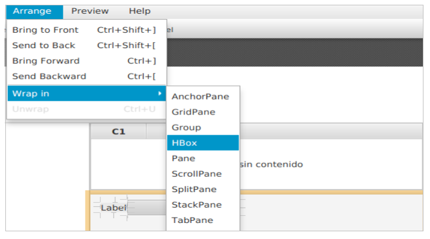
</div>

After that, select the space (margin) that will separate the elements inside the HBox from each other (in pixels).

<div align="center">
    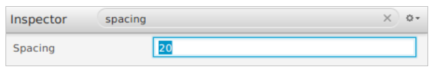
</div>

We repeat these same steps for the Food category row and for the Weight row. Then, we will have three HBox layout managers inside our AnchorPane:

<div align="center">
    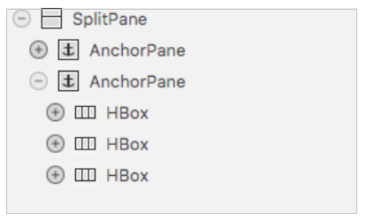
</div>

We can now wrap these HBoxes inside a VBox to treat the whole form at once. Select the three HBox containers and wrap them in a VBox, as we did before for the form controls. We can also set the vertical spacing for this VBox.

<div align="center">
    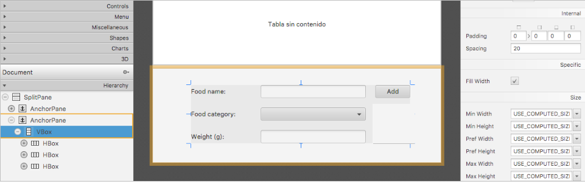
</div>

Finally, in order to let the form grow or shrink as we resize the window, select the VBox and anchor it to its left and right borders:

<div align="center">
    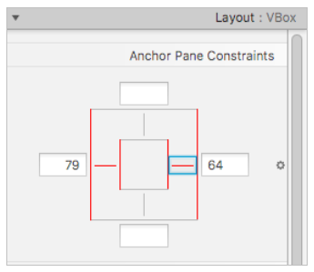
</div>

If you try to resize the window now, you'll notice that labels may hide their content if they shrink too much. To avoid this, we can set a minimum width for them:

<div align="center">
    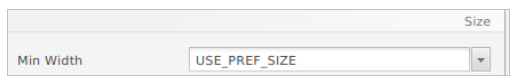
</div>

We can also tell the input fields to grow as much as possible if we increase window width. This can be set with these two properties:

<div align="center">
    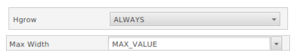
</div>

#### 6.2. Loading data into the table

It's time to fill our food table with some data. In order to do so, we are going to create a class called `Food` in a package called `healthymenu.model`.

This class will have the following attributes:

* Food name (*String*)
* Food category (*String*)
* Food weight in grams (*int*)

Besides, it will have a constructor to assign these values, and the corresponding getters and setters. Finally, we will add an additional getter to calculate the weight in ounces from the grams attribute. An overridden version of the `toString` method can also be helpful for later purposes:

```java
public class Food
{
    private String name;
    private String category;
    private int weight;

    public Food(String name, String category, int weight)
    {
        this.name = name;
        this.category = category;
        this.weight = weight;
    }

    public String getName()
    {
        return name;
    }

    public void setName(String name)
    {
        this.name = name;
    }

    public String getCategory()
    {
        return category;
    }

    public void setCategory(String category)
    {
        this.category = category;
    }

    public int getWeight()
    {
        return weight;
    }

    public void setWeight(int weight)
    {
        this.weight = weight;
    }

    public float getWeightInOz()
    {
        return (float)weight * 0.035274f;
    }

    @Override
    public String toString()
    {
        return name + ";" + category + ";" + weight;
    }
}
```

Now, let's move to our main controller class. For this example we have called the *TableView* object `tableFood`, and the corresponding columns are `colFoodName`, `colFoodCategory`, `colWeightG` and `colWeightOz`. We need to specify the data type of these elements, so that they will be like these ones:

```java
@FXML
private TableView<Food> tableFood;
@FXML
private TableColumn<Food, String> colFoodName;
@FXML
private TableColumn<Food, String> colFoodCategory;
@FXML
private TableColumn<Food, Integer> colWeightG;
@FXML
private TableColumn<Food, Float> colWeightOz;
```

We need to define a collection of `Food` objects to fill the table. As you have learnt in previous session, tables use a special type of collection called `ObservableList` to fill the data. So we create a new attribute of this type in the controller:

```java
private ObservableList<Food> food;
```

and we can initialize it with some sample data in the `initialize` method.

```java
food = FXCollections.observableArrayList(
    new Food ("Potatoes", "Fruits and vegetables", 200),
    new Food ("Chicken", "Meat and fish", 300),
    new Food ("Milkshake", "Milk derivatives", 250),
    new Food ("Salmon", "Meat and fish", 300)
);
```

Finally, we associate this list to the table, setting the attribute for each column (also in the `initialize` method):

```java
colFoodName.setCellValueFactory(new PropertyValueFactory("name"));
colFoodCategory.setCellValueFactory(new PropertyValueFactory("category"));
colWeightG.setCellValueFactory(new PropertyValueFactory("weight"));
colWeightOz.setCellValueFactory(new PropertyValueFactory("weightInOz"));

tableFood.setItems(food);
```

After these steps, we should see the table this way when we launch the application:

<div align="center">
    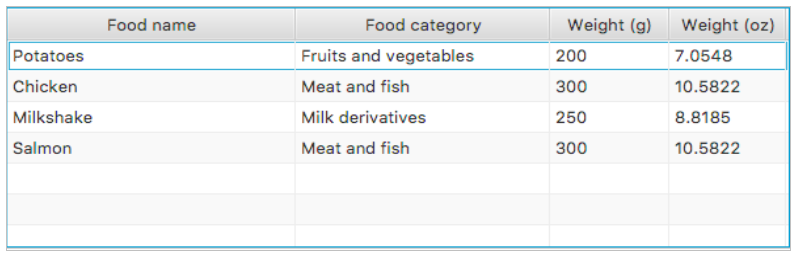
</div>

Notice that we have associated each table column with a getter method of `Food` class by its name (without the *get* prefix). We can still improve the appearance of the table by formatting the weight in ounces with 2 decimal numbers. To do this, we can just return a formatted *String* in the corresponding getter (`Food` class), instead of returning just a float:

```java
public String getWeightInOz()
{
    DecimalFormat df = new DecimalFormat();
    df.setMaximumFractionDigits(2);
    return df.format((float)weight * 0.035274f);
}
```

We also need to change the *generics* configuration of the associated table column, since now it contains a formatted String:

```java
private TableColumn<Food, String> colWeightOz;
```

**Reading/Saving data from/to a file**

In order to have a more professional application, let's replace our sample food list with a list read from a text file. The text file will have the following structure:

```
Food name;Category;Weight in grams
```

We can create a file called `food.txt` in the root folder of our project, and fill it with our sample data:

```
Potatoes;Fruits and vegetables;200
Chicken;Meat and fish;300
Milkshake;Milk derivatives;250
Salmon;Meat and fish;300
```

Then, we can create two static methods in our controller (or in a separate class, if we plan to use them elsewhere) to read the data from the file (and return a list of food) and store the data, respectively.

```java
private static List<Food> readFile()
{
    try
    {
        return Files.lines(Paths.get("food.txt"))
            .map(line -> new Food(line.split(";")[0], line.split(";")[1],
                Integer.parseInt(line.split(";")[2])))
            .collect(Collectors.toList());
    } catch (Exception e) {
        return null;
    }
}

private static void saveFile(List<Food> food)
{
    try(PrintWriter pw = new PrintWriter("food.txt"))
    {
        food.stream()
            .forEach(f -> pw.println(f.toString()));
    } catch (Exception e) {}
}
```

Notice that we rely on the `toString` method in the `saveFile` code to automatically output the string version of the Food object. Also check how easy is to read or write a text file using functional programming (streams and lambdas).

We can use `readFile` method in the `initialize` method, in order to fill `food` list (we no longer use our pre-defined list of food in this method):

```java
food = FXCollections.observableArrayList(readFile());
```

Finally, we will use the `saveFile` method whenever we add new food to the list, as soon as we define the event to add food in next steps.

#### 6.3. The chart view

Let's create now our secondary view. It will be a view with a pie chart and a button to go back to the main view. Create a new FXML file in the *resources* folder, in the same package than the primary FXML file. Call it `chart.fxml`, and create a new controller associated to it, in the same package than `MainController` class, called `ChartController`.

Then, we edit FXML file in Scene Builder. We can use a vertical `SplitPane` as the main layout manager, with the top pane greater than the bottom pane:

<div align="center">
    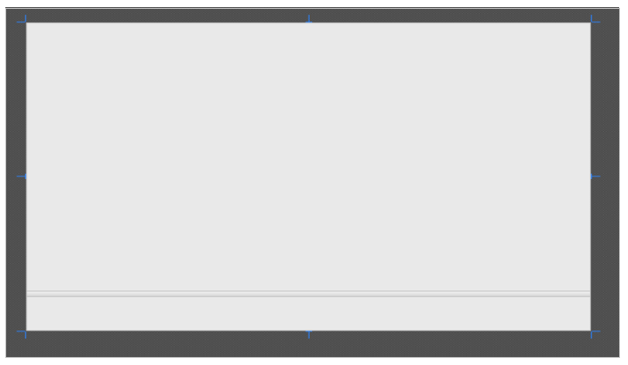
</div>

Add a PieChart at the top pane (and fit it to parent), and a button in the middle of the bottom pane. You should get something like this:

<div align="center">
    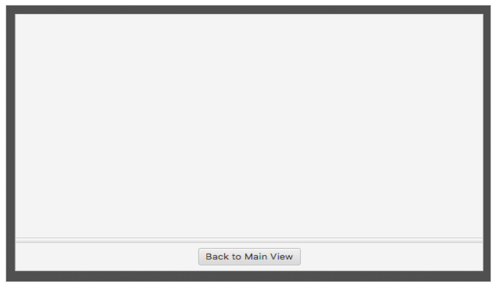
</div>

In order to show this view from the main one, we need to add a new button in that main view. We can do it under the Add button:

<div align="center">
    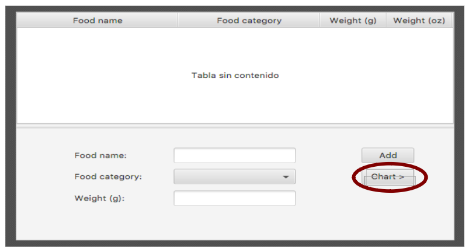
</div>

#### 6.4. Adding events

To finish the main behaviour of our application, we need to add three events:

* An event to add a new food to the table whenever we click on the *Add* button, and then save the changes into a file.
* An event to change to the chart view and update its contents whenever we click on the *Chart* button
* An event to go back to the main view when we click on the *Back to Main View* button

**Adding new food to the table**

To add new food to the table when we click on the Add button, we firstly specify the event name to be fired when we click on the button:

<div align="center">
    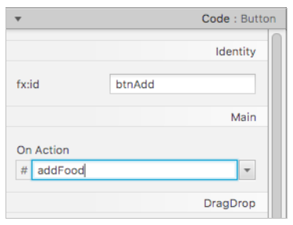
</div>

Then we make the controller, and fill the code of this event handler:

```java
private void addFood(ActionEvent event)
{
    if (txtName.getText().equals("") ||  
        choiceCategory.getSelectionModel().getSelectedIndex() < 0 ||
        txtWeight.getText().equals(""))
    {
        Alert dialog = new Alert(AlertType.ERROR);
        dialog.setTitle("Error");
        dialog.setHeaderText("Error adding data");
        dialog.setContentText("No field can be empty");
        dialog.showAndWait();
    } else {
        food.add(new Food(txtName.getText(),
            choiceCategory.getSelectionModel().getSelectedItem(),
            Integer.parseInt(txtWeight.getText())));
        saveFile(food);
    }
}
```

As you can see, we check if there is any empty input field. If not, then we add a new *Food* object to the list (we consider that the user will specify correct data into each input field), and use `saveFile` method defined before to store the information in the text file.

**Changing view to chart view**

Whenever we want to see the chart view, we need to pass to this view the current food list. So it is a good idea to define a public getter for this attribute in the main controller:

```java
public List<Food> getFood()
{
    return food;
}
```

Then, we define a new event in the *Chart* button to change to the chart view:

```java
private void goToChartView(ActionEvent event) throws IOException
{
    FXMLLoader loader = new FXMLLoader(HealthyMenu.class.getResource("chart.fxml"));
    Parent view1 = loader.load();
    Scene view1Scene = new Scene(view1);
    Stage stage = (Stage) ((Node) event.getSource()).getScene().getWindow();
    stage.hide();
    stage.setScene(view1Scene);
    stage.show();
}
```

Inside the chart view controller, we go to the `initialize` method and define the code to get the food list from the main controller, and then update the pie chart data from it.

```java
public void initialize()
{
    // Get the controller object to get to the food list

    FXMLLoader loader = new FXMLLoader(HealthyMenu.class.getResource("main.fxml"));

    try
    {
        Parent root = (Parent)loader.load();
    } catch (Exception e) {}

    MainController controller =
        (MainController)loader.getController();

    List<Food> food = controller.getFood();

    // Update the pie chart data from the food list data

    pieChart.getData().clear();

    // We get a map with all the categories and the sum of its weights
    Map<String, Integer> result;
    result = food.stream()
                 .collect(Collectors.groupingBy(
                    f -> f.getCategory(),
                    Collectors.summingInt(f -> f.getWeight())
            ));

    // We add an entry for the pie chart with each category and its sum
    result.forEach((cat, sum) -> {
        pieChart.getData().add(new PieChart.Data(cat, sum));
    });
}
```

Note how we get to the main controller, get the food list and then (again) use functional programming to easily produce a map with the categories and the sum of their corresponding weights. This is what we reflect on the pie chart.

<div align="center">
    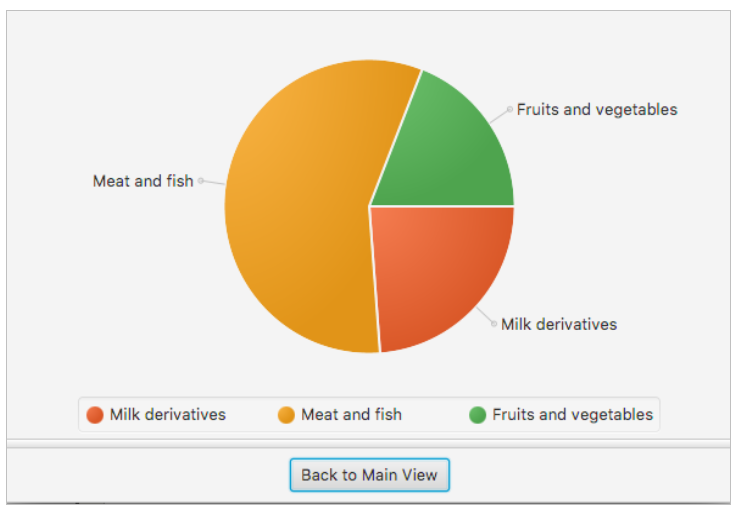
</div>

**Changing view to main view**

Finally, we need to add an event to the *Back to Main View* button in the `ChartController` to go back to the main view.

```java
private void back(ActionEvent event) throws IOException
{
    FXMLLoader loader = new FXMLLoader(HealthyMenu.class.getResource("main.fxml"));
    Parent view1 = loader.load();
    Scene view1Scene = new Scene(view1);
    Stage stage = (Stage) ((Node) event.getSource()).getScene().getWindow();
    stage.hide();
    stage.setScene(view1Scene);
    stage.show();
}
```

> **NOTE**: we could have also used the `ScreenLoader` class commented in previous subsections to avoid duplicating the code to change the view.

> **NOTE**: every time we change the view of an application, the corresponding `initialize` method is called. Keep that in mind.

#### 6.5. Modularity

We may need to update `module-info.java` file to be able to use current package structure:

```java
module healthyMenu
{
    requires javafx.controls;
    requires javafx.fxml;

    exports healthymenu.model;

    opens healthymenu;
}
```

In [this video](https://youtu.be/YBZMYxBY6to) you have a step by step tutorial about how to implement this application. You can follow it if you need some more help.

> **Exercise 4:**
>
> Update the **HealthyMenu** project by adding a *Delete* button at the bottom form, with this appearance:

<div align="center">
    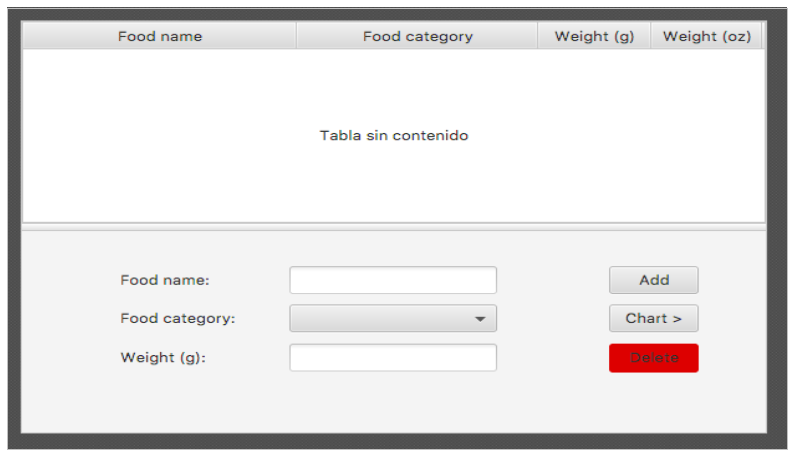
</div>

> When that button is clicked, it will delete currently selected row from the table (and from the associated list and text file as well). Before deleting the row, a confirmation dialog will be shown to ask the user if he really wants to delete the selected row.

### 7. JavaFX animations

JavaFX also provides some ways to animate our controls or nodes. Basically, what we do is to change the properties of the nodes (size, position, color...) at regular intervals. In this process, there are two important factors:

* How much do we change the node properties. For instance, if we are moving a button, it will move faster if we increase its X position from 3 to 3 pixels than if we increase it from 1 to 1 pixel.
* The frequency of these changes. If we change the position of the button every 20 milliseconds, it will move slower than if we change it every 10 milliseconds.

There are two ways of making an animation: one of them is totally manual, and the other is (almost) totally automatic.

#### 7.1. Automatic animations

The easiest way to create an animation is by using transition classes. There are some types of transition classes, such as `TranslateTransition` (to move elements), `RotateTransition` (to rotate elements), `FadeTransition` (to change the opacity)... All these transitions have some useful methods, such as:

* `play` / `playFromStart`: plays the animation from its current position or from the start, respectively
* `stop` / `pause`: stops or pauses the animation, respectively.
* `setCycleCount`: sets how many times should the animation be repeated. If we want to repeat it indefinitely, we can use the Timeline.INDEFINITE constant.
* `setAutoReverse`: sets if the animation should reverse every time it finishes.
* `setInterpolator`: sets how to calculate the intermediate positions of the animation. Some of its possible values are `Interpolator.LINEAR` (always at the same speed), `Interpolator.EASE_IN` (faster at the beginning), `Interpolator.EASE_OUT` (faster at the end), `Interpolator.EASE_BOTH` (default value, it means faster at the beginning and at the end)...

Apart from these common methods, there are also some particular methods that belong to each concrete type of transition. For instance, if we use a `FadeTransition`, we will have to set the initial value of the opacity, and the final value. If we use a `RotateTransition`, we will have to specify the initial and the final angles.

The following example moves a label `lbl` from the left of the window to the right (assuming a window of 300px width), in 3 seconds.

```java
TranslateTransition t = 
    new TranslateTransition(Duration.millis(3000), lbl);
t.setFromX(0);
t.setFromY(0);
t.setToX(300);
t.setToY(0);
t.play();
```

In the transition constructor, we specify the duration of the transition (3 seconds), and the node or control to which it will be applied (the label). Then, we set the initial and final values (position) of the node (label), and the `TranslateTransition` object takes the control by calling its `play` method. In this example, we could have omitted the lines referring to Y coordinate (`t.setFromY` and `t.setToY` methods), since we are moving the label horizontally.

We can also combine some transitions to run one after the other by using the `SequentialTransition` class. We add as many transitions as we need in its constructor, and then call its play method.

```java
SequentialTransition s = 
    new SequentialTransition(t1, t2, t3, t4);
s.play();
```

If we need to run some transitions in parallel (simultaneously), we use the `ParallelTransition` class, in the same way that `SequentialTransition`:

```java
ParallelTransition p = new ParallelTransition(t1, t2);
p.play();
```

> **Exercise 5:**
> 
> Create a project named **AnimationCredits**. The window will have a black `FlowPane` at its bottom (use a `BorderPane` as main container), and inside this `FlowPane` there will be a label with white text with your name. This text must be continuously coming from the left side of the window and hiding at the right side, like a ticker.

<div align="center">
    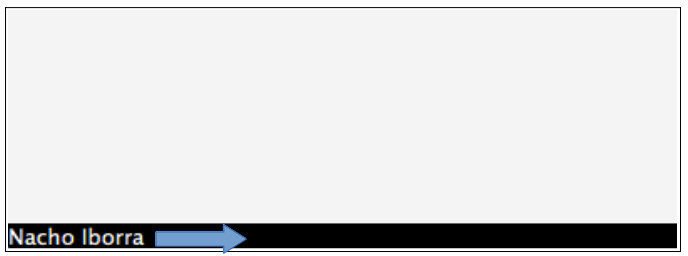
</div>

#### 7.2. Manual animations

If we prefer to create an animation in a more manual way, we need to work with these classes:

* `KeyFrame`, a timing interval that launches an *ActionEvent* every time the interval expires. We need to specify the duration of the interval and the event handler that will control the *ActionEvent*.
* `Timeline`, a sequence of *KeyFrames*. When we call it, each *KeyFrame* is played in sequence.

If we wanted to create the same animation as in previous example with these classes, we would have the following code:

```java
KeyFrame kf = new KeyFrame(Duration.millis(10), e ->
{
    lbl.setTranslateX(lbl.getTranslateX() + 1);
});

Timeline t = new Timeline(kf);
t.setCycleCount(300);
t.play();
```

The `KeyFrame` will be activated every 10 milliseconds, and then it will increase the label X coordinate in 1 pixel. Finally, we add the `KeyFrame` to a `Timeline`, and set the cycle count. This value must be calculated manually. In our example, if we want to move the label from X = 0 to X = 300 in 3 seconds, moving it 1 pixel every 10 milliseconds, then we need a total of 300 iterations to get to X = 300.

> **Exercise 6:**
>
> Create a project called **GrowingButton** with a button in the middle (use a `BorderPane`), with a preferred width of 100 pixels and a preferred height of 50 pixels (use the corresponding properties, or the methods `setPrefWidth` and `setPrefHeight` to set these values at the beginning). Every time we move the mouse inside the button, its width and height must grow up to 300 x 250 pixels, in 2 seconds. As soon as we move the mouse outside of the button, it must recover its initial size. Do this animation with the manual technique.
