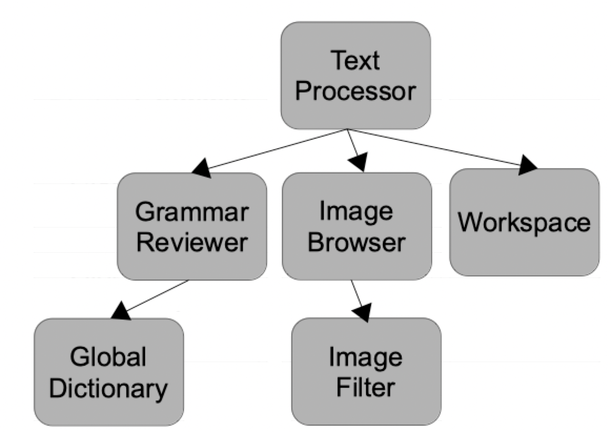

# Concurrent programming

## Introduction to concurrent programming

<!--
&nbsp;&nbsp;
-->

In this unit we are going to go through some of the most important concepts of concurrent programming, but before we get started, we should get familiar with some basic concepts about what a program or process is, and how the operating system deals with them.

### 1. Programs and processes

We can define a **program** as a set of instructions packaged as a bundle, that helps the user solve a problem or complete a task. When a program is running, it becomes a **process**, this is, a set of data and instructions placed in memory and handled by the processor and the operating system to complete a task.

So everytime we run a program on our system, we are creating a process in memory for this program. This process includes basically two elements:

* *A program counter*, some kind of index that points to the concrete instruction we are currently running among all the instructions that are part of the program.
  
* *A memory space*, where all the data and instructions needed by the program are placed, loaded and edited while the program is running.

Besides, we need to keep in mind that processes are independent. If we run a second instance of the same program, another process will be created, with its own program counter and its own memory space, and all the data and operations performed by this second instance will be completely independent from the ones performed by the first instance. You can check this easily by loading twice your web browser. You can load different pages in each window, or download a file with one of them while you read a web page with the other. Moreover, if you run the task manager of your operating system, you will see two processes running for the same browser (*firefox*, *chrome* or any other browser you might have run).

#### 1.1. The operating system and its processes

The operating system is the intermediary between the user and the programs he/she uses. It runs those programs, and tries to make the user feel comfortable with the computer. Besides, he tries to optimize the usage of all the computer resources (RAM memory, disk space, CPU usage...).

All the modern operating systems can run more than one program at the same time. This is a type of concurrency that is commonly called multitask. Thanks to it, you can listen to music while you write a document or surf the Internet. But this is not the type of concurrency that we are going to deal with in this unit. 

### 2. Concurrent programming

As we have introduced previously, concurrency lets the system have some tasks or processes running at the same time (the printing of a document, a music player running, a web browser downloading files...). All these tasks can be run on:

* **A single processor**. In this case, there is actually one process running at the same time, but the user has the experience of having all the tasks running together. To make this possible, the operating system alternates the execution of these processes after a short period of time (some milliseconds). This is what we actually call **concurrency**. 

    

> In this case, concurrency might not improve the global execution time of all the programs running, since they just swap and wait for a new turn, but in some cases it can be an improvement in terms of time, specially when a task is taking up the CPU without doing anything (for instance, when a program is waiting for the user to type something).

* **Multiple processors**, or **multiple cores** in a processor. This is something that is becoming more and more usual in current processors. They usually have two, four or even more cores, and they allow what we call **parallel processing**. If we are running some processes at the same time, or just a single process, and we have enough number of cores, each core will be in charge of running one of these processes, or a given set of instructions of a single process, and then the performance will be significantly improved. Otherwise, if there are more processes or tasks than cores available, then the operating system will have to apply concurrency, by alternating processes or sets of instructions in one or some cores. 

    

In both cases (concurrency or parallel processing), we might need to create a program that can perform some tasks at the same time. For instance, a file manager that lets us browse our hard disk while it copies some GB from one folder to another. This is the kind of programming techniques that we are going to cover in this unit.

There are other types of programs whose parts need to be run separately, or independently. In this group we can talk about **distributed programming**, where we have some computers connected in a network, and we need to run a part of the program (tipically the server) on one computer and the other part (typically the client) on another different computer. We will not see this type of programming in this unit, although we will come back to this concept in later units in this course.

### 3. Processes and threads

When we talk about concurrent programming, we actually talk about multiple programs trying to get to the same resources (a processor, a file...), or a program that needs to divide its task into some small subtasks. In the first case, each of these programs (or instances of the same program) are **processes**. In the second case, each subtask initiated inside the same program is a **thread**. Let's see the differences and similarities between these two concepts.

#### 3.1. Process/Thread states

Every process or thread can be in any of the following states during its life period:

* **New**: the process or thread has been just created, but it has not started running yet.
* **Ready**: the process or thread is not currently running, but it is ready to do it.
* **Running**: the process or thread is currently running on a given core or processor.
* **Locked**: the process or thread is waiting for some event to happen. This event may be a user input, a file unlocking... Whenever this event happens, the process becomes ready.
* **Finished**: the process or thread has finished its task, or the operating system has forced it to finish with an interruption.
  
The process or thread can change from one state to another at any time, although not all the combinations of changes are possible. Here we can see a schema of the states and their possible next states:

    

#### 3.2. Process/Thread context

When a process or thread changes its state from *running* to *ready* or *locked*, it has to leave temporarily the processor or core where it was running, and then the operating system has to save all the data related to that process, in order to recover it when the process comes back to the processor. This data is called the **context** of this process or thread, and it includes the process state, and the memory state (data values, current instruction...).

While the context is being saved, processor is just waiting, and this implies that the system is wasting some time in the meanwhile. At this point, there is a very important **difference** between processes and threads: whereas the first ones have completely independent contexts, threads that are part of the same parent process share their memory space. So saving a thread context is faster and easier than saving a process context, since the operating system does not have to care about the memory space, because it will be the same for all the threads. It only has to save the current instruction index and the thread state. However, if we do not use threads carefully, we may alter shared data that we did not want to alter. Depending on the data we are managing, the expected speed, and the programming language that we are using, we will rely on processes or threads to implement our concurrent program.

#### 3.3. Process/Thread trees

At this point you should already know that, whenever we run a program, a process is created in memory. Then, from this initial process, other processes or threads can be created and launched, depending on the application. And subsequently, more processes or threads can be launched from previous ones... This creates a tree rooted on the initial program or application, in which each subprocess or thread can be the parent of other processes or threads. For instance, if we run a text processor, we may have all these processes or threads running at the same time:

    

We may work out that every process or thread has a parent process/thread. Even the root process of an application has a parent, that can be part of the operating system (in programming languages such as C), or part of a special layer created by the language environment itself (in languages such as Java, with its own *Java Virtual Machine*). Every process has a number assigned by the operating system to identify it among all the existing processes. This feature applies only to processes, not to threads (a thread can never be launched from the operating system itself, they always belong to a given process or application).
