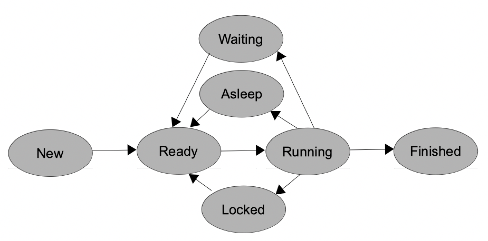

# Concurrent programming

## Basic thread management

<div style="text-align: right">
<!--
<a target="_blank" href="slides/14c.html"></a>&nbsp;&nbsp;
-->
<a target="_blank" href="14c.pdf"></a>
</div>

When talking about Java, we must take into account that everything is a thread, even the main application, and everything generated from this application is a thread, so the most important element of concurrent programming in Java are **threads**. As we have seen in previous sections, a thread is some kind of subprocess or subtask whose context is shared partially with the rest of threads of the same application. To be more precise, every thread of the same application have the same memory space, so they all share the same data.

We can do more or less the same type of operations with threads and processes: create them, synchronize them, destroy them... But you will notice in a few minutes that the "thread world" offers a wide range of possibilities that you can't find for processes. That is because your Java main application is a thread already, and Java is therefore focused on threads.

### 1. Thread states

Processes and threads go through the same states along their life period, as we have explained before [here](14a). But, in addition to those states, we could add a few more to that list, regarding Java threads: 

* **Asleep**: the thread has fallen asleep due to a call to the `sleep` method that we will see later. As soon as the sleep time expires, it will come back to the *Ready* state.
* **Waiting**: the thread is waiting for other thread to reactivate it. It happens when threads are fighting for limited resources, and the one who gets them is in charge of notifying the others when it has finished. We will also see this feature in other documents in this unit. 

A thread can get to these states from a *Running* state (only when it is running it can be asked to sleep or wait), and when it wakes up, it goes to the *Ready* state until it runs again. So with these new states, our schema for Java thread states would be like this:

<div align="center">
    
</div>

There are some other states that have been deprecated, such as *suspended* (in earlier versions of Java we could pause and resume *Threads* from anywhere, and it was potentially dangerous to data and application integrity) or *stopped* (a way of forcing a thread to finish, that was also potentially dangerous).

### 2. Basic thread handling. Creating and launching threads

#### 2.1. Defining a thread

If we want to define a thread, we have some ways to do it:

* Inheriting from `Thread` class
* Implementing `Runnable` interface

**Inheriting from *Thread* class**

There is a class in Java called `Thread`, that can be used for creating threads by *inheriting* from it, and implement (override) its `run` method.

```java
public class MyThread extends Thread
{
    ... // Attributes, constructors and methods of our class
 
    @Override
    public void run()
    {
        // Code to be executed by the thread
    }
}
```

**Implementing *Runnable* interface**

We can also create a class that implements `Runnable` interface and implements its run method.

```java
public class MyOtherThread implements Runnable
{
    ... // Attributes, constructors and methods of our class
    @Override
    public void run() 
    {
        // Code to be executed by the thread
    }
}
```

In this last case, we can also use an anonymous class or a lambda expression to define the `Runnable` object.

```java
Runnable lambdaRun = () -> {
    // Code to be executed by the thread
};
```

As you can see, in all of these cases, we need to define (override) a `run` method that we "inherit" either from `Thread` class or from `Runnable` interface. This will be the *main* method of our thread.

#### 2.2. Creating and launching a thread

To start running a thread (remember, your main application is also a thread running on the JVM), we do not have to call its *run* method directly: there would not be any multitask, since current thread (typically your main application) would execute run method, not the new thread itself. Instead of doing this, we have to call the *start* method that every thread has, and then the system loads the thread state in memory and calls the *run* method properly, so that we will be able to have as many threads as we need, running all together.

If we defined the thread by extending `Thread` class, then we can create a thread object and run it with these instructions (according to previous *MyThread* class example):

```java
Thread t = new MyThread();
t.start();
```

If we defined the thread by implementing `Runnable` interface, then we can create and run a thread by defining a new instance of `Thread` with a `Runnable` object as parameter. Let's see both examples (normal class and lambda expression) created before:

```java
// Normal class that implements Runnable
Thread t = new Thread(new MyOtherThread());
t.start();

// Lambda expression
Thread t = new Thread(lambdaRun);
t.start();
```

By doing this, the `Thread` object that we have just created knows where to find its `run` method: in the `Runnable` object that receives as a parameter.

#### 2.3. Extending *Thread* or implementing *Runnable*?

As you will find in many other situations along your career as a programmer, there are different ways of doing the same thing. In this case, we can create and launch a thread in two flavours: by extending `Thread` class or by implementing `Runnable` interface. In the end, the behavior of the thread created will be the same, but there are some differences or reasons to choose one way and not the other:

* If you extend `Thread` class, you will not be able to extend any other class. So use this way only when your thread class does not need to inherit from anything else. This option is usual in small, simple applications.
* Otherwise, you have "option B", this is, implementing `Runnable` interface (or using anonymous classes or lambda expressions). Remember, you can implement multiple interfaces, but you can only extend one class. That is why Java leaves this open door: in case you have already extended another class, you can still have your threads on it. This option is more usual in complex applications.

#### 2.4. Example

Let's type an example to see how a thread works. To start with something simple, we are going to create a thread that counts from 1 to 10. As we do not need to extend from any other class, we are going to create a `Thread` subclass. In later examples we will use `Runnable` interface, so that you will see how to work with both options.

Our basic thread would be like this:

```java
public class MyCounterThread extends Thread 
{
    @Override
    public void run 
    {
        for (int i = 1; i <= 10; i++)
            System.out.println("Counting " + i);
    }
}
```

And our main program that creates and launches this thread looks like this:

```java
public class MyMainCounter 
{
    public static void main(String[] args) 
    {
        MyCounterThread t = new MyCounterThread();
        t.start();
    }
}
```

Try to copy these classes in a project and run the main program to see that it works properly. Now, let's add some changes to main program to see how its initial behavior changes. If we put this line at the end of `main` method:

```java
public class MyMainCounter 
{
    public static void main(String[] args) 
    {
        MyCounterThread t = new MyCounterThread();
        t.start();
        System.exit(0);
    }
}
```

What happens when we run the program again? If you run the program multiple times, you will find out that sometimes it counts to 10, sometimes it does not count anything... and sometimes it counts to somewhere between 1 and 10. This is because main program is finished unexpectedly with this *exit* method, and then all of its threads are killed as well. If the thread started running before its parent was killed, it will be able to count some numbers.

Now change that instruction for this one:

```java
public class MyMainCounter 
{
    public static void main(String[] args) 
    {
        MyCounterThread t = new MyCounterThread();
        t.start();
        System.out.println("Hello!!");
    }
}
```

What happens now? Your thread counts to 10, and somewhere in the in between of this counting a "*Hello!!*" message appears. Maybe it will be shown before number 1, or after number 7... It depends on the moment when the main program reaches the processor to print its message.

Finally, try to call the `start` method again after its first call:

```java
public class MyMainCounter 
{
    public static void main(String[] args)
    {
        MyCounterThread t = new MyCounterThread();
        t.start();
        t.start();
    }
}
```

You will see that an exception of type `IllegalThreadStateException` is thrown. We can't call the `start` method **more than once**. We have to create a new Thread object.

#### 2.5. Conclusions

From this example, we can come to some conclusions:

* When we launch a thread from our main application, it starts its independent, parallel running.
* When our main application finishes correctly, our thread keeps on running its task until it finishes.
* When our main application is forced to finish, our thread finishes as well unexpectedly. To be more precise, if any thread of our application calls the `System.exit` method, all the threads will finish their execution.
* There is no way to know the exact order in which the main application and its threads will produce their results. It depends on the task planner. Anyway, we will learn how to give more CPU time to some threads at the expense of the others in brief, and also to synchronize or coordinate threads to produce results in a given order.
* After launching a thread, we will not be able to call its start method again. But we will be able to call some other methods to get its state and some other features, as we will see later.

> **Exercise 1:**
> 
> Create a project called **FibonacciThread**. Define a thread subclass that shows Fibonacci numbers up to a given parameter N that will be passed to the constructor.
>
> *Remember that Fibonacci numbers are a sequence starting by 1 and 1, on which each new number is calculated by adding the two previous numbers of the sequence. So the sequence goes like this: 1, 1, 2, 3, 5, 8, 13, 21...*

> **Exercise 2:**
>
> Create a project called **MultiplierThreads**. Define a thread subclass that has a number as its attribute. Assign a value to this number through the constructor of the class. In the `run` method, the thread has to show the multiplication table of its attribute. Then, from main application, create 10 threads (each one with a different number) and launch them all at the same time. See how messages from one thread mix with other threads' messages. For instance...

```
1 x 0 = 0
1 x 1 = 1
3 x 0 = 0
4 x 0 = 0
...
```

### 3. Basic thread information

There are some useful methods and properties in *Thread* class to get and set some information about a thread. We are going to focus on three of them for now:

* How to set and get the thread's name
* How to get the thread state
* How to get thread's identifier

#### 3.1. Setting and getting the thread's name

If you want to give a name to your threads, you can simply add an attribute `name` to your class (either extending `Thread` or implementing `Runnable`). But there are some methods in `Thread` class that let us set and get this name without adding any extra information:  `setName` method sets our thread's name, `getName` method will get this name.

```java
Thread t = new MyCounterThread();
t.setName("MyThread A");
t.start();
System.out.println("Thread " + t.getName() + " has been launched.");
```

In this example, we have created a thread, set its name and then print it a few lines below. If we want to get/set thread's name inside the thread itself (for instance, from run method of the thread), we can call `currentThread` method to get a *Thread* object that points to current thread, and then get/set its name.

```java
@Override
public void run() 
{
    Thread.currentThread().setName("AAA");
    ...
    System.out.println(Thread.currentThread().getName());
}
```

If you run a thread from a `Runnable` instance, you can set the name directly when creating the thread as the second parameter in the constructor.

```java
Runnable counterRun = () -> {
    System.out.println(Thread.currentThread().getName() + " running");
    for (int i = 1; i <= 10; i++)
        System.out.println("Counting " + i);
};
Thread t = new Thread(counterRun, "CounterThread");
t.start();
```

#### 3.2. Getting thread state

We can also get current thread state at any time. To manage these states, there is an inner enum called `Thread.State`, and a `getState` method in `Thread` class. The following example launches a thread and, a few lines below, checks its current state:

```java
Thread t = new MyCounterThread();
t.start();
...
Thread.State st = t.getState();
```

What `getState` method returns can be one of the following states, that are represented by constants in `Thread.State` enum: `NEW`, `RUNNABLE`, `BLOCKED`, `WAITING`, `TIMED_WAITING` or `TERMINATED`. For instance, if we want to check if the thread has finished its task, we can do it like this:

```java
if (st == Thread.State.TERMINATED)
    System.out.println("Thread is terminated.");
```

We can also check if a thread has finished its task with `isAlive` method (from `Thread` class):

```java
if (!t.isAlive())
    System.out.println("Thread is terminated.");
```

#### 3.3. Getting thread's identifier

Java Virtual Machine assigns a unique identifier to every thread that is created. If we want to get it, we only have to call the `getId` method from `Thread` class:

```java
@Override
public void run() 
{
    ...
    System.out.println("Thread #" + Thread.currentThread().getId());
}
```

### 4. The *sleep* and *yield* methods

In this section we are going to learn how to put threads to sleep, or ask them to leave the processor free.

#### 4.1. The *sleep* method

When we call `sleep` method, the thread that is calling it automatically falls asleep (i.e. pauses its running), until the number of milliseconds indicated in the parameter expires. This is useful to let the processor free for other threads, if our current thread has nothing to do by now, or if we want to help improve the concurrency among our threads.

The `sleep` method is a static method of `Thread` class, so to call it we only have to add this instruction in the position where we want the thread to sleep, with the desired sleeping time in milliseconds:

```java
Thread.sleep(2000);
```

This example puts the thread that executes the instruction to sleep during 2 seconds (2000 milliseconds). In fact, we need to catch a possible exception that can be thrown when using this method:

```java
try 
{
    Thread.sleep(2000);
} catch (InterruptedException e) {
    ...
}
```

Notice that, even if we use a thread object to call this method…

```java
public static void main(String[] args) 
{
    Thread t = new MyThread();
    t.start();
    t.sleep(2000);
}
```

The thread represented by object `t` will not sleep, but our main application will. Remember: the thread that calls the method is the one that sleeps.

Regarding milliseconds, we can also use `TimeUnit` class (from `java.util.concurrent` package) and its properties to specify another time unit, that will be automatically converted to milliseconds. For instance, if we want our thread to sleep 5 seconds, we can also do it like this:

```java
import java.util.concurrent.TimeUnit;
...
try 
{
    TimeUnit.SECONDS.sleep(5);
} catch (InterruptedException e) { ... }
```

You can take a look at Java API to see more constants that you can use from `TimeUnit` class, such as `MINUTES`, `HOURS`, and so on. The calling to `TimeUnit.sleep` generates a call to `Thread.sleep` in fact, with the appropriate conversion to milliseconds.

#### 4.2. The *yield* method

The `yield` method is similar to sleep method, but it does not need a number of milliseconds as a parameter. It just leaves the processor free so that the task planner can assign it to another thread. If no other thread is waiting for the processor, then the thread that yielded gets it back.

This method is also static, and it is also applied to the thread that calls it. It does not throw any exception when it is called, so we can use it simply like this:

```java
Thread.yield();
```

There is a potential problem when using `yield` method: the task planner of JVM may ignore this instruction, so we can't be sure that a thread will yield when we ask it to.

#### 4.3. Example

In this example, we are going to define a thread (implementing `Runnable` interface through a lambda expression) that counts from A to Z, sleeping 100ms after printing each letter. Main program will wait for this thread to finish, checking its state after each iteration.

```java
public static void main(String[] args)
{
    Thread t = new Thread(() -> {
        for (char c = 'A'; c <= 'Z'; c++)
        {
            System.out.println(c);
            try
            {
                Thread.sleep(100);
            } catch (InterruptedException e) {
                System.err.println("Error: Thread interrupted");
            }
        }
    });

    t.start();
    do
    {
        try
        {
            Thread.sleep(100);
        } catch (InterruptedException e) { }
    } while (t.isAlive());
    System.out.println("Thread has finished, and so do I");
}
```

Notice that main program just sleeps a few milliseconds (they can be 50, 100, 200... it does not matter) on each iteration. It only has to wait for the thread to finish, it has nothing to do, so it better leave the processor free by sleeping or yielding.

> **Exercise 3:**
>
> Create a project called **ThreadRace**. Define a subclass of `Thread` and create 3 objects of this subclass. Each one will have its own name A, B and C, and they will have to count from 1 to 1000. The main program will have to wait for all its threads to finish, and it will have to sleep 100 ms after each iteration, and write the current counting for each thread. For instance:

```
Thread A: 77  Thread B: 82   Thread C: 67
Thread A: 121 Thread B: 124  Thread C: 117
...
```

> You can also call the Java *garbage collector* in each iteration of `run` method if you consider that your threads are running too fast. Just add this line inside the loop of `run` method and the count will slow down:

```java
System.gc();
```

### 5. Finishing and interrupting threads

There are two ways of forcing a thread to finish its task: using boolean flags to tell the thread that it must stop when it checks those flags, or using interruptions to make it stop.

#### 5.1. Finishing threads with boolean flags

Threads finish their task when they execute every instruction of their `run` method. There is no way we can stop a thread at a given moment (there was a *stop* and a *destroy* methods in earlier versions of Java, but now they are deprecated). Even if we put its variable to *null*, the thread resources will keep locked.

But do not worry. We still have one method of asking a thread to finish, even though it will not finish at this precise moment. This method is applied to threads that have some kind of loop in their `run` method. If we implement this loop properly, we can use a **boolean flag** to tell the thread if it can go on or if he must finish.

Let's see this method with an example. If we define a thread subclass like this one:

```java
public class KillableThread extends Thread 
{
    boolean finish = false;

    public void setFinish(boolean finish) 
    {
        this.finish = finish;
    }

    @Override
    public void run() 
    {
        while (!finish) 
        {
            ... // Thread task
        }
    }
}
```

Then we can create and launch a thread from our main application, and ask the thread to finish with its *setFinish* method:

```java
public static void main(String[] args)
{
    KillableThread kt = new KillableThread();
    kt.start();
    ...
    if (someCondition)
        kt.setFinish(true);
}
```

As soon as the thread goes to the beginning of the loop and checks that `finish` variable is true, it will finish its `run` method.

> **Exercise 4:**
>
> Create a project called **ThreadRaceKilled** based on the project created in *Exercise 3*. Modify the main application so that, as soon as thread A gets to 700, it is asked to finish (with a boolean variable). Feel free to add all the code that you need to each class of the project.

#### 5.2. Finishing threads with interruptions

There is a second way of finishing a thread. It consists in calling the `interrupt` method of this thread. Let's see this in the following example:

```java
public static void main(String[] args) 
{
    Thread t = new Thread(() -> {
        try 
        {
            while (!Thread.currentThread().isInterrupted()) 
            {
                System.out.println("Running");
                Thread.sleep(100);
            }
        } catch (InterruptedException e) { }
        System.out.println("Finished by an interruption");
    });

    t.start();
    try 
    { 
        // Wait for a while...
        Thread.sleep(1000);
    } catch (InterruptedException e) { }

    t.interrupt();
}
```

In this example, we create a thread that checks in every loop if it has been interrupted (with `isInterrupted` method, from `Thread` class). If not, it keeps on running (i.e., printing a message and sleeping 100ms). From the main thread, we wait some milliseconds and then interrupt the previously created thread with *interrupt* method. This method causes an `InterruptedException` that makes the thread go to the `catch` section and finish the `run` method.

The `InterruptedException` is only thrown because of the `sleep` call in `Runnable`. If we do not call `sleep`, `wait`, `join` or any other method that may throw this exception, the `try...catch` structure would not be necessary, and this thread would finish by calling its `isInterrupted` method. Notice that a thread decides if it responds to the interruption or not, by using its `isInterrupted` method and/or by catching the possible exceptions that can be thrown.

### 6. Thread groups and daemons

#### 6.1. Thread groups

Java lets us put some threads into a group so that we can treat this group as a single unit. This way, we will be able to have some threads doing a task, and control them regardless of the total number of threads in the group.

To manage groups, we have the `ThreadGroup` class. We can create a basic group with a given name, and even a group inside another group, with its own name:

```java
ThreadGroup g1 = new ThreadGroup("Main group");
ThreadGroup g2 = new ThreadGroup(g1, "Additional group inside main group");
```

To add threads to a group, we can use some of the constructors available in `Thread` class. For instance, if we create a thread by extending `Thread` class, we can add it to a group with this constructor (and some others, check the API for more details):

```java
public Thread(ThreadGroup group, String name);
```

If we created the thread by implementing `Runnable` interface, we can add it with these constructors (and some others, check the API for more details):

```java
public Thread(ThreadGroup group, Runnable target);
public Thread(ThreadGroup group, Runnable target, String name);
```

Once we have added the threads to a group, there are some useful methods inside `ThreadGroup` class, such as:

* `activeCount`: returns how many threads in this group (and its subgroups) are currently active (not finished)
* `enumerate(Thread[] array)`: copies into the specified array every active thread of the group (and its subgroups)
* `interrupt`: interrupts all threads in the group.
* `setMaxPriority / getMaxPriority`:  sets/gets the maximum priority of the threads in the group.

**Example**

The following example creates some threads from a class that implements `Runnable` interface. These threads are supposed to generate a random number between 1 and 10, sleep the number of seconds specified by this random number, and then print a message in the screen. But as soon as the first thread finishes its task, the whole group is interrupted.

The code for the Runnable object is:

```java
import java.util.Random;
import java.util.concurrent.TimeUnit;

public class MyRandomMessage implements Runnable
{
    Random r = new Random (System.currentTimeMillis());
    @Override
    public void run()
    {
        int time = r.nextInt(10) + 1;
        try
        {
            TimeUnit.SECONDS.sleep(time);
            System.out.println("Thread waited " + time + 
                " seconds and finished.");
        } catch (Exception e) {} 
    }
}
```

Then, our main program would be like this:

```java
public static void main(String[] args)
{
    ThreadGroup g = new ThreadGroup("Random messages");
    MyRandomMessage m = new MyRandomMessage();
    Thread t1 = new Thread(g, m);
    Thread t2 = new Thread(g, m);
    Thread t3 = new Thread(g, m);
    t1.start();
    t2.start();
    t3.start();

    while (g.activeCount() == 3)
    {
        try
        {
            Thread.sleep(100);
        } catch (Exception e) {}
    }
    g.interrupt();
}
```

As soon as one thread finishes, `activeCount` method will return a number lower than 3, and main thread will finish its loop and interrupt all the threads. If the other threads are still waiting for its time to expire, they will be interrupted, an exception will be thrown and they will not print their finish message.

#### 6.2. Daemon threads

A daemon thread is a special type of thread that executes a periodic task from time to time. Their main properties are:

* They have very low priority (i.e., they run when no other "normal" thread needs to run)
* Main program does not wait for them to finish. This is, if every thread of the program has finished but a daemon thread is still running, it will be finished as well.

Due to this reason, a daemon thread should not do any critical task, because it can be interrupted at any moment, and we do not know when it will be able to do that task. A good example of a daemon thread is the Java garbage collector.

To create a daemon thread, we only have to call the `setDaemon` method from `Thread` class before starting the thread:

```java
Thread t = new MyThread();
t.setDaemon(true);
t.start();
```

We can also use the `isDaemon` method from `Thread` class to check if a given thread is a daemon or not.

### 7. Threads, context and shared data

Every thread created by the same application share a common context. What does this exactly mean? Let's take a look at the following example (some lines are numbered to be explained later):

```java
public class ContextExample implements Runnable 
{
    // Reference to current thread
    Thread t;

    public void start2Threads() 
    {
        // Create first thread
        t = new Thread(this);
        t.start();

        // Sleep for 5 seconds
        try 
        {
            Thread.sleep(5000);
        } catch (InterruptedException e) { }

        // Create second thread
        t = new Thread(this);                  // Line #1
        t.start();

        // Sleep for 5 seconds
        try 
        {
            Thread.sleep(5000); 
        } catch (InterruptedException e) { }

        // Destroy thread
        t = null;                              // Line #2
    }

    @Override
    public void run() 
    { 
        // Take initial time in milliseconds
        long ini = System.currentTimeMillis();
        while (t == Thread.currentThread()) 
        {
            System.out.println("Running thread (" + ini + ") ");
            // Sleep for 100 ms
            try 
            {
                Thread.sleep(100);
            } catch (InterruptedException e) { } 
        }
        System.out.println("Finishing thread (" + ini + ") ");
    }

    public static void main(String[] args) 
    {
        ContextExample t = new ContextExample();
        t.start2Threads();
    }
}
```

Type or copy this code into a project. Test it and try to ask the following questions before reading their corresponding answers:

1. What does de `while` condition of `run` method do?

    It keeps on looping while variable `t` points to the thread that is currently running. When this variable points to another thread (it happens in *Line #1*), then previous thread finishes its `while` loop.

2. Can there be two threads executing their `run` methods at the same time?

    Yes. As soon as *Line #1* is executed, second thread is ready to start. It may happen that it starts before previous thread checks its `while` condition or finishes its `run` method. In this case, both threads would be executing their `run` methods.

3. If the answer to previous question is *yes*, could those threads come into conflict with variable `ini`, so that one thread overwrites the value previously written by the other?

    No, `ini` variable is a local variable of `run` method, so each call to such method creates its own local `ini` variable. However, `t` attribute is shared for all the threads created. That is why, when it changes its value, previous thread finishes its task and new thread is associated to that variable (both threads share the same value for `t`).

4. How can we stop a thread in this example without creating a new one?

    We only have to set `t` attribute to null, as in *Line #2*.

#### 7.1. Conclusions

After testing this example, we can come to some conclusions:

1. Every attribute of the same object is shared among all the threads of our application. That is why, when main program changes the value of t attribute in previous example, both threads see that change.
2. If we call a method multiple times (for instance, `run` method every time we create and start a thread), its local variables are different in each call (they are not shared). That is why each thread on previous example has its own ini value.
3. If we create a `Thread` subclass instead of implementing `Runnable` interface, each attribute of this subclass is not shared among threads, since we instantiate every thread and thus we create its own memory space, as we do with every instantiated object. 

For instance, if we define this class:

 ```java
public class MyThread extends Thread 
{
    int num;

    public MyThread(int num) 
    {
        this.num = num;
    }
    ...
}
```

then attribute `num` will be different for every instantiated thread. So if we type something like this:

```java
MyThread t1 = new MyThread(10);
MyThread t2 = new MyThread(20);
```

Then object `t1` will have its `num` attribute with value 10, and `t2` will have it with value 20. 

#### 7.2. *ThreadLocal* variables

We have seen that, if we use the same object in different threads (a `Runnable` object or any other object), they all share this object's data. But sometimes we will need to have an attribute that is not shared among threads. To do this, we can use the `ThreadLocal` class, that lets us specify a data type to create an attribute of this type, and create multiple values of this attribute, each one assigned to a different thread.

For instance, if we want our threads to have their own creation date, we will do something like this:

```java
public class MyRunnableClass implements Runnable
{
    private static ThreadLocal<LocalDate> creationDate = new ThreadLocal<LocalDate>()
    {
        protected LocalDate initialValue()
        {
            return new LocalDate.now();
        }
    }
}
```

If we want to get the value of this attribute for each thread, we will call its `get` method, and if we want to assign a new value, we will call its `set` method. The `initialValue` method in the code above is executed when the attribute has no value and the thread is trying to get it. There is also a `remove` method that we can use to remove the value of this attribute from current thread.

Then, we can have a `run` method like this in our `MyRunnableClass` class:

```java
@Override
public void run()
{
    System.out.println("This thread was created on " + creationDate.get());
    System.out.println("Updating creation date...");
    creationDate.set(LocalDate.now());
    System.out.println("Now the creation date is " + creationDate.get()); 
    System.out.println("Removing value...");
    creationDate.remove();
    System.out.println("Now the creation date is " + creationDate.get()); 
}
```

The code above will show three different dates for the same thread, one for each call to get, since we set a new value between the first and the second call, and we remove the value after this second call.
