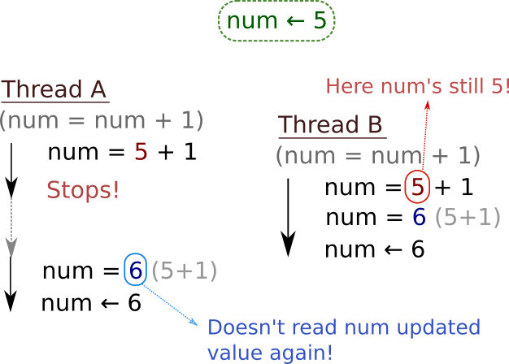

# Concurrent programming

## Threads and shared data

<div style="text-align: right">
<!--
<a target="_blank" href="slides/14f.html"></a>&nbsp;&nbsp;
-->
<a target="_blank" href="14f.pdf"></a>
</div>

In this subsection we are going to see which type of objects we shall use in order to deal with simple values or collections safely in a multi-threaded application.

### 1. Accessing single values

Let's start by learning how to solve some problems associated with single values (primitive and object), how to write (update its value) and read them safely when many threads are accessing at the same time.

#### 1.1. Introducing the problem

Let's suppose that we have a class to manage a variable (integer) and some methods to modify it and get its value.

```java
public class SimpleInteger 
{
    int num;

    public SimpleInteger(int num) 
    {
        this.num = num;
    }

    public int getNum() 
    {
        return num;
    }

    public void setNum(int num) 
    {
        this.num = num;
    }

    public void increment() 
    {
        num++;
    }
}
```

Now, let's create some threads that modify the values of that number by calling the available `increment` method (we'll manage them with an *Executor*):

```java
public static SimpleInteger simpleInt = new SimpleInteger(0);

public static void main(String[] args)
{
    ThreadPoolExecutor executor =
        (ThreadPoolExecutor)Executors.newCachedThreadPool();

    for(int i = 0; i < 10000; i++) 
    {
        executor.execute(() -> simpleInt.increment());
    }

    executor.shutdown();

    while(!executor.isTerminated()) 
    {
        try 
        {
            Thread.sleep(100);
        } catch (InterruptedException e) {}
    }
    System.out.println("Expected: 10000, Result: " + simpleInt.getNum());
}
```

What happens when we execute this code? We may have results like these:

```
Expected: 10000, Result: 9954
Expected: 10000, Result: 9924
```

We can see that there's a problem. 10,000 threads incrementing each one the same variable should give us always 10,000, but we get a different result each time and none is correct. Here is why: let's examine this operation: `num++`. For the compiler, this increment is translated like this → `num = num + 1`. There are **three operations** taking place here (imagine current value for `num` is 5):

* Variable substitution: `num = 5 + 1`
* Adding operation: `num = 6`
* Assigning the new value to num: `num` ← 6

If this thread (when current value is 5) stops **just after** doing the first or second step, the next thread accessing that variable won't see the value updated and will see that's still 5. This second thread will then increment 5 and assign 6 to the variable num. When the first thread wakes up, it will **continue from the last step before stopping**, so it will assign 6 like the other thread (one increment has been lost!!).

<div align="center">
    
</div>

#### 1.2. Solving it with synchronize

As we have seen in previous documents, a synchronized block or method only allows to enter **one thread** at a time. If a thread wants to enter while another is inside, it will be **stopped** until the thread inside the block or method exits.

We can use it in different ways:

* Outside the class (in main method for example):

```java
executor.execute(() -> {
    synchronized(simpleInt) 
    {
        simpleInt.increment();
    }
});
```

* Inside the object methods, whenever we try to change the value of the variable which can be accessible by more than 1 thread:

```java
public void increment() 
{
    synchronized(this) 
    {
        num++;
    }
}
```

* In the method declaration (for every method that changes the value of the variable)

```java
public synchronized void increment() 
{
    num++;
}
```

We must use **only one solution** from above (not all of them). Now, it works properly and produces → **10,000** as the result.

#### 1.3. Solving it with atomic objects

Instead of synchronization, we can also use **atomic variables** (since Java 5), a mechanism to check that the operation applied to a given variable is done in one step. This way, we can use data types such as `AtomicLong`, `AtomicInteger` or `AtomicBoolean` to deal with simple long, integer or boolean data types. So, instead of doing this (which is not thread-safe):

```java
long num;
num = 10;
num++;
```

we can do this:

```java
AtomicLong num = new AtomicLong();
num.set(10);
num.getAndAdd(1);
```

If we apply this to our problem, we can use an *AtomicInteger* variable instead of just an *int*:

```java
public class SimpleInteger
{
    AtomicInteger num;

    public SimpleInteger(int num) 
    {
        this.num = new AtomicInteger(num);
    }

    public int getNum() 
    {
        int localReturn = num.get();
        return localReturn;
    }

    public void setNum(int num) 
    {
        this.num.set(num);
    }

    public void increment() 
    {
        num.incrementAndGet();
    }
}
```

There is an additional type called `AtomicReference`, which is parameterized, so that we can use it to make any other data type atomic:

```java
AtomicReference<String> name = new AtomicReference<String>();
name.set("Nacho");
System.out.println("My name is " + name.get());
```

> **Exercise 1:**
> 
> Create a project called **AtomicCounter** from the example shown in section 2 of [this document](14d) with no synchronization mechanism. You must now use an `AtomicInteger` attribute (instead of the int attribute of that example), to guarantee that the `increment` and `decrement` operations against this object will be atomic and thus thread-safe.

### 2. Accessing arrays

Regarding **arrays**, Java also provides atomic data types to deal with them. For instance, you can use `AtomicIntegerArray` to handle integer arrays, or `AtomicReferenceArray` to handle many other data types.

```java
// Create an array of strings with size 10
AtomicReferenceArray<String> names = new AtomicReferenceArray<String>(10);

// Add names to some positions
names.set(0, "Arturo");
names.set(1, "Nacho");

// Get names at given positions
System.out.println("Name at 1st position is " + names.get(0));
```

### 3. Concurrent and synchronized collections

When we want to use data collections in a concurrent program, we have to be very careful with the way we handle these data. Many of these collections, such as `ArrayList`, are not ready to work with multiple threads, and if many of them are trying to modify the same element, it can be assigned a wrong, final value. But there are some other collections that we can use safely.

#### 3.1. Synchronized collections

Synchronized collections are generated from the static class [Collections](https://docs.oracle.com/javase/8/docs/api/java/util/Collections.html). Those collections synchronize the access to the list (every method except iterators), blocking the entire list to only one thread at a time.

```java
// Not synchronized
List<String> list = new ArrayList<>(); 				
// Synchronized
List<String> syncList = Collections.synchronizedList(list); 
```

#### 3.2. Concurrent collections

Regarding concurrent collections, they can be:

- **Blocking**: when we try to add or remove something to/from the collection and we can't, our thread gets blocked until the operation can be made. In this group we can use, for instance, the  `LinkedBlockingDeque` class. It has a `put` method to add elements to the list, `getFirst/getLast` to get them from the beginning/end of the list and `takeFirst/takeLast` method to get and remove them from the beginning /end of the list. Check the API for a full explanation of these and other methods.

```java
LinkedBlockingDeque<String> data = new LinkedBlockingDeque<String>();
data.put("One element");
data.put("Another element");
String first = data.takeFirst();
```

- **Non-blocking**: if our add/remove operation can't be performed, a null value is returned, or an exception is thrown. In this group we can use, for instance, the `ConcurrentLinkedDeque` class. It has the `add` method to add elements to the list, `getFirst/getLast` to get the first or last element of the list, `removeFirst/removeLast` to remove the first/last element of the list, and so on (check the API for a full explanation of its methods).

```java
ConcurrentLinkedDeque<String> data = new ConcurrentLinkedDeque<String>();
data.add("One element");
data.add("Another element");
String first = data.getFirst();
data.removeFirst();
```

Regarding maps, we can use, for instance the `ConcurrentSkipListMap`, which is a *non-blocking* implementation of some kind of hashtable. For instance, we could store a set of book titles, identified by their ISBN:

```java
ConcurrentSkipListMap<String, String> map = 
    new ConcurrentSkipListMap<String, String>();
data.put("1122", "Ender's game");
data.put("3344", "The Da Vinci's code");

Map.Entry<String, String> element = map.firstEntry()
String isbn = element.getKey();
String title = element.getValue();
System.out.println("First element is " + isbn + " - " + title);
```

#### 3.3. Synchronized vs concurrent

There is an important difference between using a synchronized collection and using a concurrent one:

* Calling a method on a synchronized collection blocks the entire collection object, so no other thread can access the collection, even if it wants to get to a different index.

* Calling a method on a concurrent collection usually blocks just the position or key to be accessed. In conclusion, these collections reach more performance than synchronized when working with many threads.

Besides, when using synchronized collections, iterating over them is not thread safe, so you'll need to implement it manually:

```java
synchronized (syncList) 
{
    // Must be in synchronized block
    Iterator i = syncList.iterator(); 
    while (i.hasNext()) 
    {
        // Do something
    }
}
```

That problem doesn't happen with concurrent collections. Their iterators are safe but they don't guarantee that if another thread changes an element while iterating, current thread will see that modification immediately.

#### 3.4. Updating internal objects

When you want to modify an internal object of the collection, if you do it by getting the object and then make some modification to its properties, you'll need to synchronize that operation (or the object's methods).

```java
ConcurrentLinkedDeque<String> data = new ConcurrentLinkedDeque<String>();
data.add("One element");
data.add("Another element");
data.getFirst().replace("One", "First");
```

When we concatenate the `getFirst` operation with the `replace` method, the first one is thread safe, but once we get the string, the second method (the replacement) is not thread safe. Then, we could, for instance, use a synchronized method that replaces the text, or methods such as `compute` that are executed in an atomic way. For instance, if we want to replace the text of the first element (index 0) of previous list, we could do something like this:

```java
data.compute(0, value -> {
    value = value.replace("One", "First");
    return value;
});
```

We take the value from that position (position 0), store the replacement and then return it, so that old value is automatically replaced by this new returned value.

> **Exercise 2:**
> 
>Create a project called **ConcurrentVideoGames**. We are going to handle a list of video games with a title and a price, according to this structure:

```java
public class VideoGame 
{
    String title;
    float price;

    public VideoGame(String title, float price)
    {
        this.title = title;
        this.price = price;
    }

    public String getTitle() 
    {
        return title;
    }

    public float getPrice() 
    {
        return price;
    }
}
```

> In main program, we will create a list of 100 videogames.
>
> *To add video games automatically, just add them with a given pattern (such as "Videogame 1", "Videogame 2"...), and the same price (or a random one)*
>
> Then, we will launch two threads:
>
> * One of them will add 1 to the price of every video game in the list (sleeping 50ms after each operation)
> * The other one will subtract 1 from the price of every video game in the list (sleeping 50ms after each operation).
>
> Try with a simple `ArrayList` firstly, and see how the total price of the list is different each time you run the program. Then, change your `ArrayList` for an appropriate thread-safe structure, such as `LinkedBlockingDeque`, and see how it works perfectly now.
