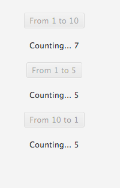
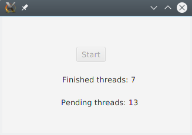
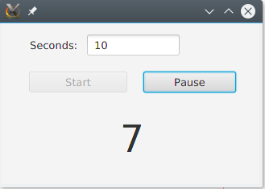

# Concurrent programming

## Threads in JavaFX applications

<div style="text-align: right">
<!--
<a target="_blank" href="slides/14g.html"></a>&nbsp;&nbsp;
-->
<a target="_blank" href="14g.pdf"></a>
</div>

When we develop a graphical application in a given Java library, such as Swing, JavaFX or even an Android application, we have to keep in mind that they all use a **single thread to process all UI events**. This is because the controls or nodes that we put on a scene are not thread-safe, so they are fast (since they do not need any synchronization mechanism), but they need to be accessed from a single thread. In the case of JavaFX, for instance, this thread must be the main JavaFX application thread. As a consequence of this, there should not be any long running task in this main application thread, because the whole application would hang until this task finishes.

This problem does not apply to animations in JavaFX. When we use a transition class, or a `KeyFrame` and `Timeline` classes to define a transition, they manage their own threads to perform the animation out of the main application thread, and we can interact with the application while the animation runs.

### 1. Introducing the problem

Let's see this problem with a JavaFX example:

```java
public class Example_JavaFXThreads extends Application
{
    // Copy progress
    int progress;

    public static void main(String[] args) 
    {
        launch(args);
    }

    @Override
    public void start(Stage primaryStage)
    {
        Label lblProgress = new Label("");
        Button btnStart1 = new Button("Start copy (1)");

        btnStart1.setOnAction(e -> 
        {
            for (int progress = 1; progress <= 10; progress++)
            {
                try
                {
                    Thread.sleep(1000);
                    lblProgress.setText("" + (progress*10) 
                                            + "% completed"); 
                } catch (Exception ex) {}
            }
        });

        VBox vb = new VBox(20);
        vb.setAlignment(Pos.CENTER);
        vb.getChildren().addAll(lblProgress, btnStart1);
        Scene scene = new Scene(vb, 300, 400);
        primaryStage.setScene(scene);
        primaryStage.show();
    }
}
```

The application of the example simulates the copy of a large file, and when we press the *Start copy (1)* button, a message is printed every second showing the percentage of file that has been copied for now. If we try to run the application and we click on the *Start copy (1)* button, we will find out that:

* The label does not update its percentage, as it should.
* If we try to close the application while the task is running, it will not close.

Why does this happen? As we have said before, all the event handling of the application runs on the main application thread. So, when it is sleeping and changing the label's text in the event loop, nothing else is running (the whole application is waiting for this event to finish).

#### 1.1. Trying to solve the problem. First attempt

We could think that, to solve the problem shown in previous example, we could just call a thread that does the file copy and updates the label progress. Let's do it. In order to keep the original program in its original version, we are going to add a new button, *Start copy (2)*, and we are going to create a thread in its *ActionEvent* to do the same task that we did before in the event handler of the first button.

We would add the button with the event handler:

```java
Button btnStart2 = new Button("Start copy (2)");

// "Start copy (2)" event: calling a thread to do the task
btnStart2.setOnAction(e -> 
{
    Thread t = new Start2Thread(lblProgress);
    t.start();
});
```

And then we would add the thread class. We pass the *Label* as a parameter to have it accessible. In the *run* method we copy the same code that we used for the *btnStart1* event.

```java
class Start2Thread extends Thread
{
    // Progress label to update its text
    Label lblProgress;

    public Start2Thread(Label lblProgress)
    {
        this.lblProgress = lblProgress;
    }

    @Override
    public void run()
    {
        for (int progress = 1; progress <= 10; progress++)
        {
            try
            {
                Thread.sleep(1000);
                lblProgress.setText("" + (progress*10) + "% completed"); 
            } catch (Exception ex) {}
        }
    }
}
```

If we click on this second button, an `IllegalStateExcepcion` will be thrown. The reason is this line of code inside the *run* method:

```java
lblProgress.setText("" + (progress*10) + "% completed");
```

As we have said before, no one but the main application thread can access the UI, because its controls are not thread-safe.

#### 1.2. Trying to solve the problem. Second and final attempt

The problem when using a secondary thread is that we can't access the UI elements from it. To avoid this, some libraries and frameworks such as JavaFX or Android provide some ways of passing tasks from those secondary threads to the main application. In our case, we need to pass to the main application the task of updating the *lblProgress* text. We can replace this line of code in the *run* method of our thread:

```java
lblProgress.setText("" + (progress*10) + "% completed");
```

with this line(s):

```java
Platform.runLater(() -> 
   lblProgress.setText("" + (progress*10) + "% completed"));
```

We have introduced a new method: the `Platform.runLater` method, whose mission is to schedule the specified task(s) to be run on the main application thread at an unspecified moment in the future (we can't control when). This way, whenever we are trying to update the status of a control from outside the main application thread, we can call this method to be sure that no exception will be thrown. We can check if we are on the main application thread or not by using the `isFxApplicationThread` method.

> **Exercise 1:**
> 
> Create a project called **My3Counters**. It must have 3 buttons and 3 labels:
>
> * A button with the text *From 1 to 10* that will start a thread that counts from 1 to 10, showing the current number in the corresponding label, and sleeping 1 second after showing each number.
> * A button with the text *From 1 to 5*, with its corresponding label, to count from 1 to 5 (1 number per second as well)
> * A button with the text *From 10 to 1*, with its corresponding label, to count from 10 to 1 (a number per second too).
>
> As soon as we click on a button, its corresponding counting will start, and the button will be disabled (use the setDisable method from the Button object). We may run the three tasks at the same time if we want to. Here you can see a screenshot of the application.

<div align="center">
    
</div>

### 2. The JavaFX concurrency framework

The example shown before only uses the basics of a JavaFX application and the basics of thread handling that we have learnt so far, and it combines them to create a multithreaded graphical application. However, this is not the "correct" way of creating such type of applications since, as soon as the application gets more and more complicated, these basic methods that we have explained (such as `Platform.runLater`) will not be enough.

In order to use a stronger way of creating multithreaded applications, JavaFX provides a concurrency framework composed of the following elements:

* The `Worker` interface. It represents every task that needs to be performed in one or more additional threads. It has an inner enum called `Worker.State`, with all the possible states of the task (READY, RUNNING, CANCELLED...)
* The `Task` abstract class implements the `Worker` interface to define tasks that can be run only once (they can't be reused).
* The `Service` abstract class also implements the `Worker` interface to define tasks that can be run more than once (they can be reused).
* The `ScheduledService` abstract class is a subtype of `Service` class to define tasks that can be scheduled to be run repeatedly after a given time interval.
* The `WorkerStateEvent` is an event that is fired every time the state of a *Worker* changes, so that we can execute some instructions or methods when this happens.

#### 2.1. Using Service

We are going to see an example of creating a `Service` and running it in background. We are going to solve the same problem shown in previous example (the simulation of a file copy) with a service. In this new example, we are going to add the possibility of cancelling the copy while it is running, an essential ability of *Service* class.

Our service class would look like this one:

```java
class FileService extends Service<String> 
{
    @Override
    protected Task<String> createTask() 
    {
        return new Task<String>() 
        {
            @Override
            protected String call() throws Exception 
            {
                for (int progress = 1; progress <= 10; progress++) 
                {
                    try 
                    {
                        Thread.sleep(1000);
                        updateMessage("" + (progress * 10) 
                                         + "% completed");
                    } catch (Exception ex) { }
                }
                return "Copy completed";
            }
        };
    }
}
```

We just extend `Service` class. It can be parameterized to set a return type, and, in our case, we are going to return a *String* when the service finishes, just to show you how this return value works. We must override `createTask` method from `Service` abstract class. Inside this method, we create an anonymous class of the task we are going to create (since `Task` is an abstract class as well, we need to either create a `Task` subclass or return a `Task` through an anonymous class). In the `call` method of this Task, we do our job (the file copy simulation). Notice that, instead of getting the label and setting its text, we just call the `updateMessage` method. In our main application we will bind the label's text with this message to update the text automatically.

Our main JavaFX controller would be like this:

```java
public class FXServiceExampleController implements Initializable 
{
    @FXML
    private Button btnStart;
    @FXML
    private Label lblProgress;
    @FXML
    private Button btnCancel;

    FileService service;

    @FXML
    private void start(ActionEvent event) 
    {
        setProperties(true, false);
        service.start(); 
    }

    @FXML
    private void cancel(ActionEvent event) 
    {
        setProperties(false, true);
        service.cancel();
    }

    @Override
    public void initialize(URL url, ResourceBundle rb) 
    {
        service = new FileService();
        // Events to be fired when service finishes/cancels/fails...

        service.setOnSucceeded(e -> {
            setProperties(false, true);
            System.out.println(service.getValue());
            service.reset();
        });

        service.setOnCancelled(e -> {
            setProperties(false, true);
            service.reset();
        });

        service.setOnFailed(e -> {
            setProperties(false, true);
            service.reset();
        });

        // Bind label text property to service
        lblProgress.textProperty().bind(service.messageProperty());
        btnCancel.setDisable(true);
    }

    // Method to disable/enable buttons and set label's text from events
    private void setProperties(boolean disableStart, boolean disableCancel) 
    {
        btnStart.setDisable(disableStart);
        btnCancel.setDisable(disableCancel);
    }
}
```

From the `start` method we have introduced some new interesting instructions: the methods from the service to start, cancel or reset it, depending on the event that we are handling. We start the service from the *Start* button event, we cancel it from the *Cancel* button event, and we reset it from some *WorkerStateEvents*, handled by the `setOnSucceeded`, `setOnCancelled` and `setOnFailed` methods. For instance, whenever the service is cancelled, the `setOnCancelled` method will be fired, and then we will reset the service. Also, we have added the **binding** from the label text property to the service message property, established in this line:
  
```java
lblProgress.textProperty().bind(service.messageProperty());
```

Thanks to this, the service can update the text of the label from its code. If you run the example, notice that, as soon as the service finishes or it is cancelled, the label text gets empty.

The service has also some other properties, such as `titleProperty`, `valueProperty`... that we can use to bind them to some other controls of our application, if we want to. This is useful when we want to update several controls from the same service.

However, if we bind a control to a property, the control's value can't be set outside this property. In other words, if we want to set the label's text directly (with its `setText` method) in the main application, an exception will be thrown. We need to unbind temporarily the control (with the `unbind` method), set the value, and bind it again to the property.

The return value of the service is used inside the `setOnSucceeded` method. When the service finishes properly, it will return a *String* with the text "Copy completed". We can check this in the standard output, thanks to this line of code:

```java
System.out.println(service.getValue());
```

The `setProperties` method is used from some events to update the "disable" state of both buttons (when we *Start* the copy, we disable the *Start* button, for instance), and the label text.

> **Exercise 2:**
> 
> Create a project called **My3CountersService**, that will be a copy of project *My3Counters* from exercise 1. In this case, you must use a `Service` to implement the 3 tasks. As soon as a given count finishes, the corresponding button must turn enabled, and we will be able to start it again.
>
> *HELP: You must implement a void Service. As Service is a parameterized class, when you want it to return a void result you must use the `<Void>` parameter. In the `call` method, it must return a `Void` type, and you can do it by using a `return null` instruction at the end of the method.*

#### 2.2. Using ScheduledService

If we want to execute a task periodically using a *Service*, [ScheduledService](https://docs.oracle.com/javase/8/javafx/api/javafx/concurrent/ScheduledService.html) is more suited for that job than using a loop with sleeping period inside a Service. This kind of task runner is very similar to what we have just seen before, but it repeats itself automatically after a period of time until we **cancel** it.

We can set a delay before the first run calling `setDelay`. The time it will wait before it starts again after it finishes is set with `setPeriod`. If all goes well, every time this service finishes its task, it will call the function passed on `setOnSucceeded`.

```java
public class FXServiceExampleController implements Initializable 
{ 
    @FXML
    private Button button;

    @FXML
    private Label threadsPending;

    @FXML
    private Label threadsFinished;

    private ScheduledService<Boolean> schedServ;
    private ThreadPoolExecutor executor;

    @Override
    public void initialize(URL url, ResourceBundle rb) 
    {
        schedServ = new ScheduledService<Boolean>() 
        {
            @Override
            protected Task<Boolean> createTask() 
            {
                return new Task<Boolean>() 
                {
                    @Override
                    protected Boolean call() throws Exception 
                    {
                        Platform.runLater(() -> {
                            threadsPending.setText("Pending threads: " + 
                                (executor.getTaskCount() - 
                                executor.getCompletedTaskCount()));

                            threadsFinished.setText("Finished threads: " +
                                executor.getCompletedTaskCount());
                        });
                        return executor.isTerminated();
                    }
                };
            }
        };

        schedServ.setDelay(Duration.millis(500)); // Will start after 0.5s
        schedServ.setPeriod(Duration.seconds(1)); // Runs every second after
        schedServ.setOnSucceeded(e -> {
            if(schedServ.getValue()) 
            { 
                // Executor finished
                schedServ.cancel(); // Cancel service (stop it).
                button.setDisable(false);
            }
        });
    } 

    @FXML
    private void startThreads(ActionEvent event) 
    {
        button.setDisable(true);
        executor = (ThreadPoolExecutor)Executors.newFixedThreadPool(
            Runtime.getRuntime().availableProcessors());

        for(int i = 0; i < 20; i++) 
        {
            executor.execute(() -> {
                Random rnd = new Random();
                try 
                {
                    TimeUnit.MILLISECONDS.sleep(500 + rnd.nextInt(5000));
                } catch (InterruptedException ex) { }
            });
        }
        executor.shutdown();
        schedServ.restart();// Start the scheduled service (or restart it)
    } 
}
```

The code above will start an executor with 20 tasks that will take between 0.5s and 5.5s to complete. The ScheduledService will start after 0.5 seconds and run every second, examining the executor (showing how many tasks are pending and how many finished) and returning if the executor has finished executing all its tasks. When the executor finishes the ScheduledService will be cancelled.

<div align="center">
    
</div>

> **Exercise 3:**
> 
> Create a project called **ScheduledChronometer**. Create a view with a *TextField* where you’ll write a number of seconds and a **Start** and **Pause** buttons.
>
> When you press Start button, launch a `ScheduledService` that will launch every second. This service will decrement the number (starting from the value in the TextField) and return it. When it arrives to 0, it will stop (cancel).
>
> If the service is running and you press Pause, it will stop. If you press start again, it will start from the last value.

<div align="center">
    
</div>

You can download [here](../../resources/en/14g_examples.zip) the source code of some examples shown in this document.