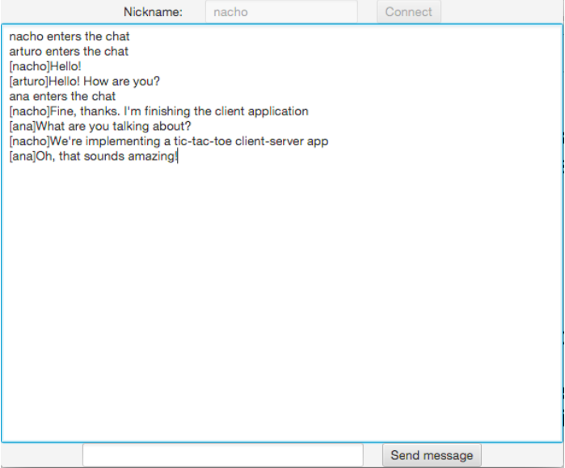

# Basic client-server communications

## Some advanced concepts about sockets

<div style="text-align: right">
<a target="_blank" href="slides/15b.html"></a>&nbsp;&nbsp;
<a target="_blank" href="15b.pdf"></a>
</div>

### 1. Object serialization in sockets

When we talk about serializing an object, we actually talk about converting it into a bit sequence, so that it can be sent through a connection or stream. In Java, we can serialize any simple value (int, char, double...) or any object that implements the `Serializable` interface. If it is a compound object, all of its attributes must be simple, or implement this interface. You can read more about object serialization in [this document](7d).

#### 1.1. Sharing classes and objects between server and client

The classes that we serialize and send between server and client must be shared between both projects. To do this, one option is to create a separate project with all the classes involved in the serialization process. 

Then, we add this project as a library of both projects (client and server). To do this, we right click on both client and server project, and go to *Open Module Settings* option. Then, from the *Project Settings* section of left panel, we choose *Modules*, click on *+* button on the right panel and then *1 JARs or directories*. Select the appropriate subfolder inside *out* directory of the common project (the one where the root package begins)

<div align="center">
    
</div>

#### 1.2. Serialization through TCP sockets

Given a TCP socket, we can create, for instance, an `ObjectOutputStream` from it and send an object through it:

```java
ObjectOutputStream objOut = 
    new ObjectOutputStream(socket.getOutputStream());
objOut.writeObject(myObject);
```

In the same way, we can create an `ObjectInputStream` in a socket, and read objects from it:

```java
ObjectInputStream objIn = 
    new ObjectInputStream(socket.getInputStream());
MyObject obj = objIn.readObject();
```

> **Exercise 1**:
>
> Create a serialization application with the following projects:
>
> * We are going to work with user data. So, create a new project called **UserData_Model**, and define a `User` class inside,  with the following attributes: the user login and password (Strings), and the registration date, and the appropriate constructors, getters and setters. The constructor must leave the login and password empty (""), and the registration date will be automatically filled with current date.
> * A server project called **UserData_Server**. When a client connects, the server will create a new *User* (from `User` class explained before). Then, it will send that *User* object to the client, and wait for a response.
> * The client project will be called **UserData_Client**. It will connect to the server, receive the *User* object, and then it will ask the user to fill its login and password. Once this data is completed, the client will send the *User* object back to the server.
> * When the server receives the complete *User* object, it will print its information in the server console.

#### 1.3. Serialization through UDP sockets

If we are working with UDP sockets, then we need to convert our serializable objects into byte arrays, so that we can put them in the datagram packets. We will use `ByteArrayInputStream` and `ByteArrayOutputStream` objects to read and write objects in this case.

So, to write a serializable object in a UDP socket, we follow these steps:

```java
// Write the object in a ByteArrayOutputStream
ByteArrayOutputStream bs = new ByteArrayOutputStream();
ObjectOutputStream objOut = new ObjectOutputStream(bs);
objOut.writeObject(myObject);
// Get the byte array from the written object
byte[] bytes = bs.toByteArray();
// Now, we just send the byte array as we did before with UDP sockets
```

If we want to read a serializable object from a UDP socket, then we do this:

```java
// Receive the byte array, as we did before with UDP sockets
byte[] bytes = new byte[1024];
DatagramPacket packet = new DatagramPacket(bytes, bytes.length);
socket.receive(packet);
// Assign the byte array to a ByteArrayInputStream, and read the object
ByteArrayInputStream bis = new ByteArrayInputStream(bytes);
ObjectInputStream in = new ObjectInputStream(bis);
MyObject obj = in.readObject();
```

> **Exercise 2**:
> 
> In this exercise we are going to simulate a simplified version of an auction. To do this, we will store the information of the product that we want to sell in a `Product` class (remember to create a separate project to handle this class). The attributes that we want to store are the product name, buyer's name and the product price. Initially, the server will create a *Product* with its product name and an initial auction price (buyer's name will be initially empty). Then, the server will wait for 3 different clients to connect, and it will send the product to them. Each client will see the product information in the console, and then they will type their name and the amount that each one wants to pay for the product, in one line, separated by a whitespace. For instance:

```
nacho 150
```

> The server will pick up the responses from all the clients, and it will take the maximum amount from them. Then, it will update product information with the current price and buyer's name, and will send the updated product to the clients, to make them know who won the auction. Here you can see an example of how it should work...
>
> 1. Initially, the server creates a product, with a name and initial price. For instance, "Xbox One", 100 euros.
> 2. Then, it will wait for 3 clients to connect
> 3. Next, it will send the whole *Product* object to each client. So they will see this information on their consoles:

```
Product name: Xbox One
Product initial price: 100 euros
```

> 4. Then, each client will be asked to introduce his name and price, in the same format explained before. For instance, we might have these three offers from the 3 different clients:

```
nacho 150
arturo 170
ana 120
```

> 5. The server will receive these 3 messages, compare them and pick up the one with the highest offer. Then, it will update the product data with the buyer's name and price, and send the information back to the clients. So, the clients would see this information as the final result:

```
Final price: 170 euros
Buyer's name: arturo
```

> Call the projects **Auction_Model** (project to store the `Product` class), **Auction_Server** and **Auction_Client**. You can also add any additional class or method that you may need (for instance, to manage clients connected to server)

### 2. Multicast sockets

Multicast sockets are a special type of sockets that we use when we want to send the same information to a group of clients at the same time. Before doing this, we need to create a multicast group, by assigning all the components of the group the same IP address (of class D), and the same UDP port number. Regarding the multicast IP addresses, we can use any from the range 224.0.0.0 to 239.255.255.255, although the first one (224.0.0.0) is reserved and it should not be used.

So the general structure of a multicast communication between server and clients is the same for server and client (the only differences are in what each side must do when receiving or sending packets from the group):

```java
MulticastSocket ms = new MulticastSocket(6000);
InetAddress groupAddr = InetAddress.getByName("225.0.0.1");
ms.joinGroup(groupAddr);
...
byte[] buffer = new byte[1024];
DatagramPacket packetR = new DatagramPacket(buffer, buffer.length);
ms.receive(packetR);
...
String message = "Welcome to this group";
DatagramPacket packetS = new DatagramPacket(message.getBytes(), 
    message.length(), groupAddr, groupPort);
ms.send(packetS);
...
ms.leaveGroup(groupAddr);
ms.close();
```

As you can see, multicast process relies on UDP protocol, so data transfers are not reliable (it would be inefficient to wait for all the clients in the group to confirm each reception).

Also keep in mind that, in some cases, you will not need any server side. For instance, if we implement some kind of simple chat, where every client connects and sends messages to everyone in the group, the server would not be necessary, since we would only need to send our messages and receive everything that is sent to the group.

> **Exercise 3**:
> 
> Create a multicast application with the following projects:
>
> * A server project called **MulticastMessage_Server** that asks the user to enter messages from the keyboard, and sends them to all the clients connected to the group. The process will finish when the user types "finish".
> * A client project called **MulticastMessage_Client** that connects to the server and prints in the console every message received from the server.
>
> **NOTE:** if you get an error such as "Can't assign requested address" when trying to launch the server or client, try to run the applications with this option:

```
java -Djava.net.preferIPv4Stack=true YourClass
```

> You can set it up in the menu *Run* > *Edit Configurations...*, and then fill the *VM Options* text field with `-Djava.net.preferIPv4Stack=true`.

> **Exercise 4**:
>
> Create a multicast application that implements a chat. In this case, we won't need a server side, jusst a client side that will be a JavaFX application in a project called **MulticastChat** with the following appearance:

<div align="center">
    
</div>

> At the beginning, it will ask the user to introduce his nickname at the top of the window, and then it will try to connect to the group. Once it connects, the user will be able to send messages with the lower text field. It will receive the messages sent by everyone and will print them in the main text area. As soon as the window client is closed, the connection must be closed as well.
>
> To receive messages from the group periodically, you will need to implement any of the thread-safe methods of communicating with a JavaFX application seen in Unit 2. For instance, you can implement a Service that periodically receives messages from the group and prints them in the text area.
